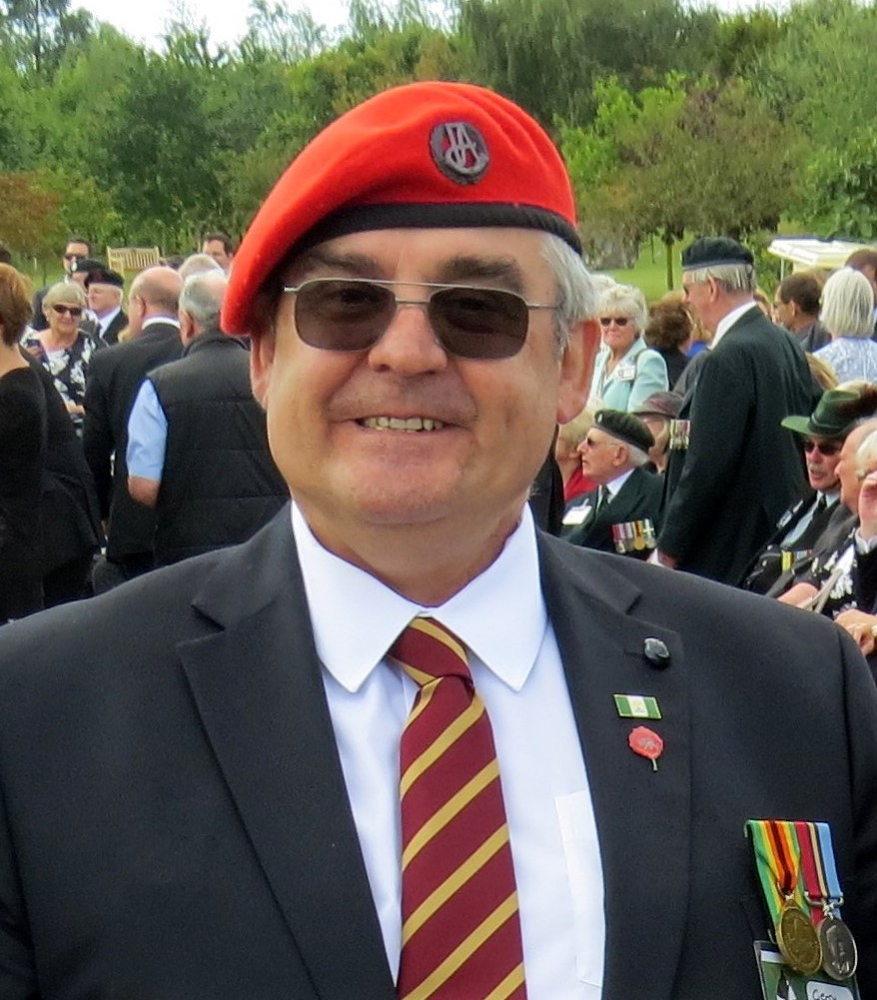

::: {layout-ncol=2}

::: {.justify}
I was born in Bulawayo in 1955 in the then Southern Rhodesia, now Zimbabwe. After
completing my primary school education at Henry Low in Bulawayo, I attended the
neighbouring Hamilton High School, a boys-only establishment, where I remained until the
start of Form IV. At this time my dad was transferred to Gwelo (now Gweru), where I
successfully sat for my ‘O’, ‘M’ and ‘A’ level certificates of education at co-ed Thornhill
High School. Leaving school at the end of 1974, I joined the Ministry of Internal Affairs (Intaf) in
January 1975. 
:::
:::

::: {.justify}
I was stationed at Karoi, Urungwe District, as a Cadet District Officer. In
broad terms, the work largely comprised the administration of virtually every aspect of the
lives of the country’s rural-based tribespeople. A year later, I reported to Chikurubi in Salisbury (now Harare) as a member of the
Internal Affairs National Service 4 (Intake 150) call-up, to undergo three months intensive
basic military training. I was then posted to Sipolilo, where I was based at Fort Harrison on
the Angwa River in the Zambezi Valley. In November 1976, I was transferred to Mount
Darwin, where he served in that large station’s intelligence section.

In January 1977, I undertook the Ministry of Internal Affairs’ sponsored university
degree programme, graduating from the University of Rhodesia at the end of 1979 with a
Bachelor of Administration (Honours) Degree. During university vacations, I was stationed
in Sipolilo and Gwelo. After graduating, I was posted to Mount Darwin as a District Officer,
being the Returning Officer for Rushinga during the Zimbabwe independence elections in
1980, and working through the period of transition from our counterinsurgency war ceasefire
and return of the ZANLA guerrillas to assembly points in the district.

At this time my British-born wife, Tracey, and I got married in Salisbury, and shortly
thereafter I left the civil service. In 1984, I was head hunted by a fresh produce marketing
cooperative in Harare, where I became managing director. Out of concern for the provision of
tertiary educational and future career opportunities for our two children, Andries and
Ashleigh, in 1999 we settled in the UK. Today they are both doctors: Andries a DPhil in
Clinical Medicine from the University of Oxford, and Ashleigh in gynaecology
and obstetrics.

Here in the UK the seed was planted that would develop into my full-blown passion
for military history.

In keeping with my proud Danish ancestry, I am using a Viking logo for the website,
courtesy of Illustrator 21.
:::