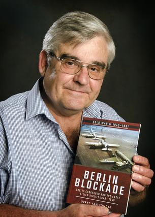

::: {layout-ncol=2}

Since coming to the UK in 1999, I have conducted Intensive research and image sourcing for the contract production of more than twenty non-fiction titles for Pen and Sword Military Books (UK), Amberley Publishing (UK) and 30 Degrees Publishing (South Africa). As a spin-off of my writing, I have conducted scores of paid research projects across the globe on behalf of historians, authors, investigative researchers, military associations, custodians of rolls of honour and memorials (e.g. Bomber Command, UK), individuals trying to acquire British citizenship and family members of past military personnel.  If there is something you would like me to research for you, just drop me a line to chat about it and to get a quote.
:::
