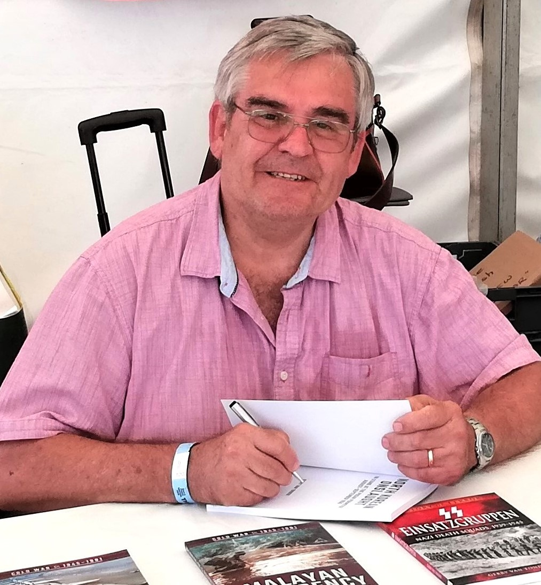

::: {layout-ncol=2}

::: {.justify}
Since coming to the UK in 1999, I have conducted extensive research and image
sourcing for the contract production of more than twenty non-fiction titles for Pen and Sword
Military Books (UK), Amberley Publishing (UK) and 30 Degrees Publishing (South Africa).
I have also self-published a couple of books. As an adjunct to book writing, I am a regular
feature-article writer for two UK military history magazines from the Key Publishing stable:
Britain at War and Classic Military Vehicle. (see [Publications](publications.md))

As a spin-off of my writing, I have conducted scores of paid research projects across
the globe on behalf of historians, authors, investigative researchers, military associations, 
:::
:::

::: {.justify}
and custodians of rolls of honour and memorials, e.g. the Commonwealth War Graves
Commission and Bomber Command, UK. I also compile ‘Fact Files’ on behalf of persons
who wish to know what a relative did during either of the two world wars. In most cases, this
will include the sourcing of actual service records. I have assisted individuals trying to
acquire British citizenship by tracing a father or grandfather’s British service records. If there
is something you would like me to research for you, just drop me a line to chat about it and to
get a quote. (see [Professional Services](services.md))

Over the years I have conducted numerous proofreading and copy-editing
commissions from publishers. I continue with providing such services to any interested
parties, be they individuals or publishing companies. (see [Professional Services](services.md))

Finally, I would like to offer my website as a place where your book can be promoted.
I will need a high-res image of the book cover and a 100-word blurb on the book. I reserve
the right to decide on what is inserted. All that it will cost you is a copy of your book for a
full review and for my library! (see [Book Reviews](book_reviews.md))

Enjoy your visit and please contact me if you have anything specific in mind. I have a
vast electronic and printed data base and an international network of contacts, so I will
endeavour to assist where I am able. (see [Contact Me](contact-me.md))
:::