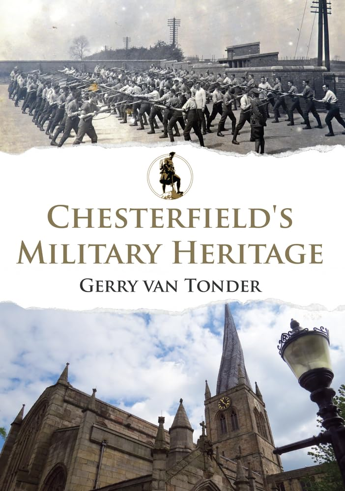
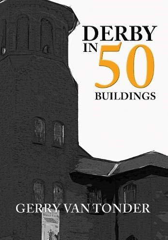
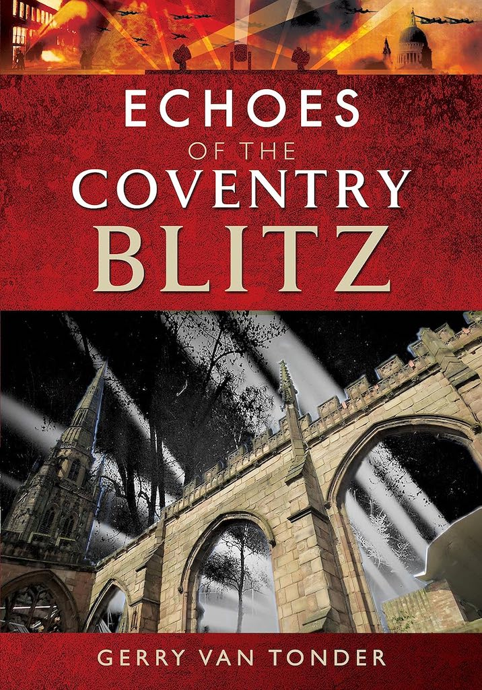
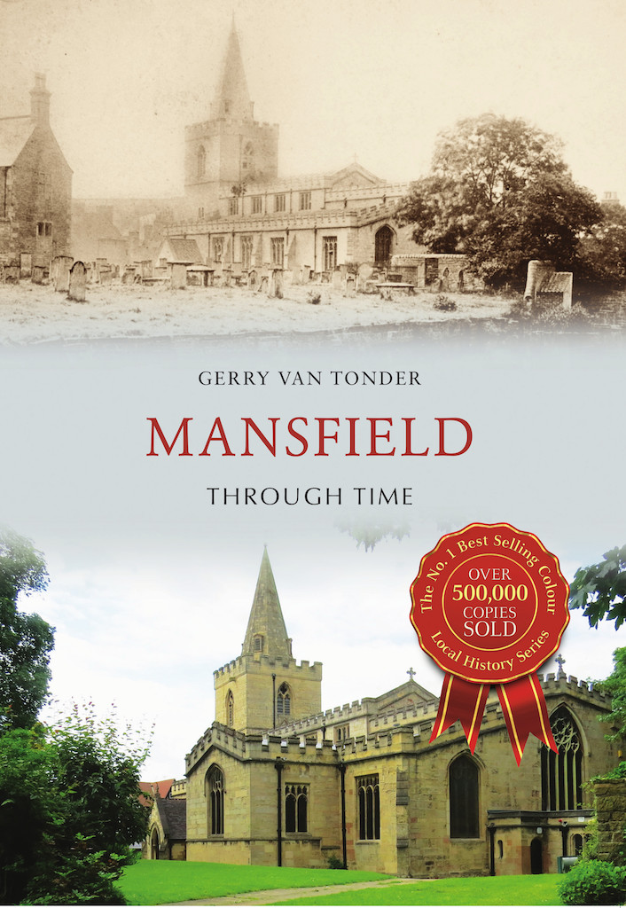
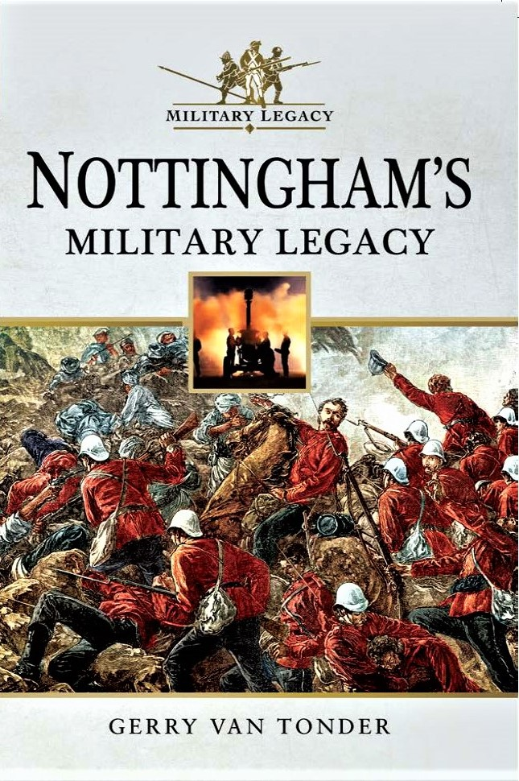
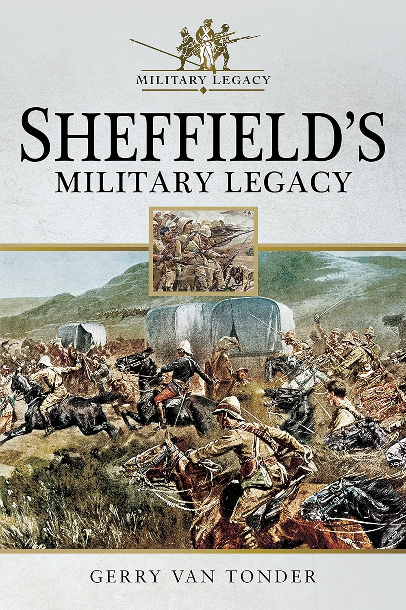

## Books

### Chesterfield’s Military Heritage

::: columns
::: {.column width="35%"}

{width=200}
:::

::: {.column width="65%" .justify}
Mention of this Derbyshire market town’s name invariably conjures up an image of an iconic landmark: the crooked church steeple. It does, however, also speak of a military heritage built up over a millennium. The word Chester itself is derived from the ancient Roman fort or ‘castrum’: military garrisons that peppered the English countryside during the occupation. In 1266, at the Battle of Chesterfield, Royal forces quashed a rebellion by local barons. Come the English Civil War 400 years later, anti-Royalist sentiment was still strong. Chesterfield deployed militia, together with a ‘company of foot’ from Derby, to defend the town from the King’s forces.

:::

::: {.justify}

In the 19th Century, the British Empire, a sprawling global property, demanded defending from armed threat. The Derbyshire and Nottinghamshire regiments of foot, later to be amalgamated as the Sherwood Foresters, attracted volunteers from the Borough of Chesterfield. Egypt and South Africa became household names, and with the outbreak of the Great War, hundreds answered Kitchener’s call. The Western Front claimed the lives of many of the town’s sons, their names commemorated in churches and on memorials throughout the town and satellite villages.

WWII saw Chesterfield’s citizens enlisting with battalions of the Sherwood Foresters, serving in theatres such as the Western Desert, Italy, France and South East Asia. 
So also came tales of acts of courage and bravery: in WWI, Fred Greaves, awarded one of the regiment’s first VCs; in WWII, Arthur Norman Crookes, the unique recipient of three DFCs and the American DFC. There were others.

Publisher: ‎Amberley Publishing (15 July 2016)

Paperback and Kindle:‎ 96 pages

ISBN:  9781445649764

[Amazon](https://www.amazon.co.uk/Chesterfields-Military-Heritage-Gerry-Tonder/dp/1445649764)

:::

:::

### Derby in 50 Buildings

::: columns
::: {.column width="35%"}

{width=200}
:::

::: {.column width="65%" .justify}
Straddling the Derwent River, the cathedral city of Derby, its foundations in the Roman occupation of Britain, can directly attribute its contemporary status to the Industrial Revolution.
Spinning mills proliferated from the 18th Century, initially relying on waterpower to produce 100 percent British cotton cloth. Victorian ingenuity and innovation became synonymous with the rapid industrial and commercial expansion that ensued – Arkwright and Pickford became household names. Derby quickly evolved into a transport and ancillary manufacturing hub in the Midlands, becoming a centre for the British rail industry and the assembly of the iconic Rolls Royce luxury motor car. 

:::

::: {.justify}
The subsequent development of the Rolls Royce Merlin aircraft engine, which powered the WWII Spitfires and Hawker Hurricanes, launched the company’s proud status to what it is today: the world’s second largest manufacturer of jet engines and, together with the Toyota car assembly plant, the biggest employer in Derby.

This book reveals the rich and diverse history that is reflected in Derby’s architecture as, through successive decades of growth, its character, built of brick and stone, underwent varying nuances of transformation. Sprinkled within this panorama, however, are the symbols of a modern city: ultra-modern structures, thought by some to be the antithesis of Derby’s true architectural heritage.

Publisher: ‎Amberley Publishing (15 April 2016)

Paperback and Kindle:‎ 96 pages

ISBN:  9781445658155

[Amazon](https://www.amazon.co.uk/Derby-Buildings-Gerry-van-Tonder/dp/1445658151)

:::

:::

### Echoes of the Coventry Blitz

::: columns
::: {.column width="35%"}

{width=200}
:::

::: {.column width="65%" .justify}
‘Smoke rises in the City of Three Spires, the smouldering remnant of the Nazi hate. Coventry and England will remember and repay’.
From August 1940, Hitler’s Luftwaffe mercilessly and indiscriminately bombed cities and towns in Britain. The historic West Midlands city of Coventry did not escape the carnage as, night after night, high-explosive and incendiary bombs rained down on the hapless production centre of cars, munitions and aero engines. Then came Operation Mondscheinsonate (Moonlight Sonata), in which thirteen waves of more than 500 German Heinkel bombers sparked an inferno of hundreds of fires, including a devastating and uncontrollable firestorm. 

:::

::: {.justify}

On this fateful night of 14 November 1940, 4,400 homes were destroyed and two-thirds of the buildings in the city centre sustained structural damage. 
Today, the iconic shell of Coventry’s once majestic medieval cathedral offers a silent memorial of remembrance to that dreadful night.
For the city’s residents of now, it is a poignant echo of a violent and destructive part of their history.  
With the digital juxtaposing of archival images with photographs taken by the author himself for this publication, and drawing from contemporary press accounts of the Coventry Blitz, this book presents a totally unique comparative insight into the Nazi bombing of Coventry in the Second World War. 

Publisher: ‎Pen & Sword History (6 Aug. 2018)

Paperback and Kindle:‎ 199 pages

ISBN:  9781526709677

[Amazon](https://www.amazon.co.uk/Echoes-Coventry-Blitz/dp/1526709678)
[Pen & Sword](https://www.pen-and-sword.co.uk/Echoes-of-the-Coventry-Blitz-Paperback/p/15095)

:::

:::

### Mansfield Through Time

::: columns
::: {.column width="35%"}

{width=200}
:::

::: {.column width="65%" .justify}
This book offers a cameo glimpse of a town whose character and identity has, over the last few hundred years, been moulded, modified and tempered by coal mining and the Industrial Revolution. 
This ancient market town evolved into Nottinghamshire’s second largest town, a strategic trading hub from which roads radiate to all cardinal points. With the surrounding area rich in coal deposits and bountiful farmland, corn and textile milling developed alongside a rapidly expanding beer brewing industry.

:::

::: {.justify}
The latter half of the 20th Century, however, witnessed the demise of both the coalmines and breweries. Engineering companies shut down and the mills closed their doors permanently. The town, to a large extent, reverted to its commercial roots, as it strived towards the regeneration of prosperity lost to the influences of multi-national economics.
Much of Mansfield’s past, previously invested in transient buildings and structures, now only exist as sepia images stored in archives. This book offers a comparative—and nostalgic—look at how the town has changed through time. 

Publisher: ‎‎Amberley Publishing (15 September 2016)

Paperback and Kindle:‎ 96 pages

ISBN:  9781445659572

[Amazon](https://www.amazon.co.uk/Mansfield-Through-Time-Gerry-Tonder/dp/1445659573)

:::

:::

### Nottingham's Military Legacy

::: columns
::: {.column width="35%"}

{width=200}
:::

::: {.column width="65%" .justify}
Two years after landing on English soil in 1066, William of Normandy erected a strategic castle at Nottingham, thereby creating an enduring military nexus through to the modern era.
On 22 August 1642, in his endeavours to quash Parliamentarian insurrection in the Midlands, King Charles raised his standard over Nottingham Castle, a rallying call to all Royalists to support their monarch. Loyalty to the Crown was, however, divided, and before long Parliamentarian forces garrisoned the castle. Late in the eighteenth century, a town troop of Yeomanry was raised in Nottingham, the foundation of the future South Notts Yeomanry.

:::

::: {.justify}
The yeomanry assisted regular troops by helping restore peace during the so-called Bread Riots of 1795, at a time when many of the town’s men had been committed to military duty during the French Revolutionary Wars. Five troops of the town’s yeomanry were again called up for service during the civil unrest of the Luddite Riots of 1811–18. This pattern of service continued over several decades. Evolving into a regiment, the yeomanry were repeatedly deployed against civil dissenters – the Nottingham Riot, and the Reform Bill and Chartist Riots.

After seeing combat during the Peninsula Wars in 1815, in the latter half of the 1800s, the 59th (2nd Nottinghamshire) Regiment of Foot formed part of a British invasion force into Afghanistan from India, to curb Russian interventionism in this remote and desolate region.  

The outbreak of war in distant South Africa in 1899 placed enormous strain on Britain’s military capability. From Nottingham and other county towns, regiments of yeomanry, Hussars and Sherwood Rangers were dispatched to the hostile environment of the African veld. Nottingham’s sons then answered a call to arms in their thousands, only to also perish in their thousands on the Godforsaken soils of France and Flanders during the holocaust that was the Great War. 

Through the Second World War to the present, Nottingham’s military units underwent successive phases of metamorphosis – from infantry to anti-aircraft and searchlight formations, followed by the relatively recent absorption into a regional entity: the Mercian Regiment. Today, Nottingham’s castle and surrounds bear the symbols of a rich and diverse military legacy—symbols of remembrance, of tribute, and of a tableau of military pride from ancient times.

Publisher: ‎Pen & Sword Military (17 July 2017)

Paperback and Kindle:‎ 128 pages

ISBN:  9781526707581

[Amazon](https://www.pen-and-sword.co.uk/Nottinghams-Military-Legacy-Paperback/p/13682)
[Pen & Sword](https://www.amazon.co.uk/Nottinghams-Military-Legacy-Gerry-Tonder-ebook/dp/B0754FM645)

:::

:::

### Sheffield’s Military Legacy

::: columns
::: {.column width="35%"}

{width=200}
:::

::: {.column width="65%" .justify}
In the century following the Norman invasion, a castle was built at the confluence of the rivers Sheaf and Don, an early recognition of Sheffield’s strategic importance. Destroyed in the thirteenth century during the Second Barons’ War, a second castle was built on the site, but in 1647, it was ordered to be demolished immediately after the cessation of the Civil War, thereby negating any future tactical use by either Parliamentarian or Royalist. 
Steel production and downstream manufacturing would, however, be perpetually embedded in the military legacy of this seat of industrial innovation and production. 

:::

::: {.justify}
The Vickers steel foundry was established in Sheffield in 1828. Following the manufacture of the factory’s first artillery in 1890, Sheffield expanded to find itself a leading supplier in the First World War, feeding the military with ammunition shells, guns and cannons for ships, armour plating, aircraft parts, torpedoes, helmets and bayonets. Sheffield’s major contribution to the British war machine in the Second World War quickly attracted the attention of Nazi Germany. In December 1940, in an operation appropriately codenamed Schmelztiegel, or Crucible, for the method of steel production, Sheffield suffered two major raids aimed primarily at steel and munitions factories. 

A centuries-old proud tradition of answering a call to the colours spawned formation titles of courage and dedicated service—the 84th Regiment of Foot, the Loyal Independent Sheffield Volunteers of the 1700s, the Hallamshire Rifle Volunteers raised in 1859, and the Sheffield Squadron, Yeomanry Cavalry. 
The 1899–1902 Anglo-Boer War would also have an enduring legacy on the town, as many volunteered to fight on the sub-continent. The Sheffield Wednesday football stadium was given the name Spioen Kop, after the famous battle in South Africa, while local road names include Ladysmith Avenue and Mafeking Place.  

On 1 July 1916, the Sheffield City Battalion fought in a heroic and costly, but hopeless, action on the Somme to capture the village of Serre, and through the Second World War right up to Afghanistan, Sheffield’s men and women in uniform were not found wanting.
Sheffield’s rich military legacy portrayed in this publication is drawn from a cross section of representative units, home and foreign actions, uniformed personalities, barracks at the hub of musters, the calibre of gallantry—including six Victoria Crosses—as well as the immortality of names on memorials, such as the Sheffield Memorial Park in France.  

Publisher: ‎Pen & Sword Military (29 November 2017)

Paperback and Kindle:‎ 128 pages

ISBN:  9781526707628

[Amazon](https://www.amazon.co.uk/Sheffields-Military-Legacy-Gerry-Tonder/dp/1526707624)
[Pen & Sword](https://www.pen-and-sword.co.uk/Sheffields-Military-Legacy-Paperback/p/14197)

:::

:::