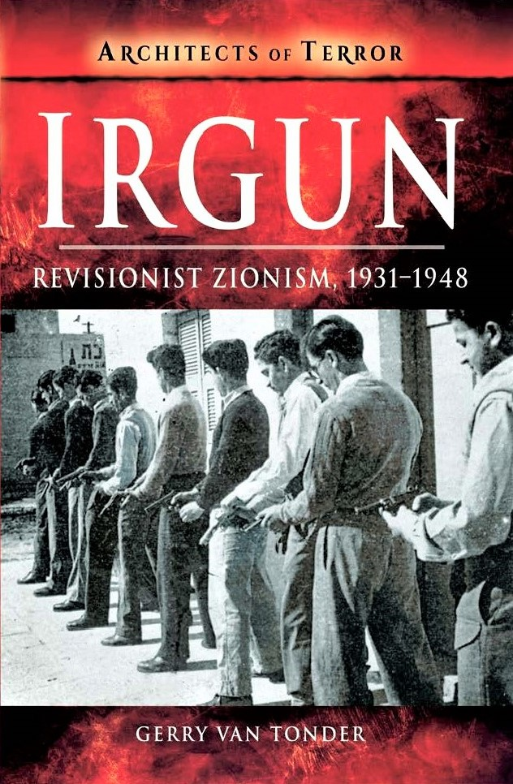
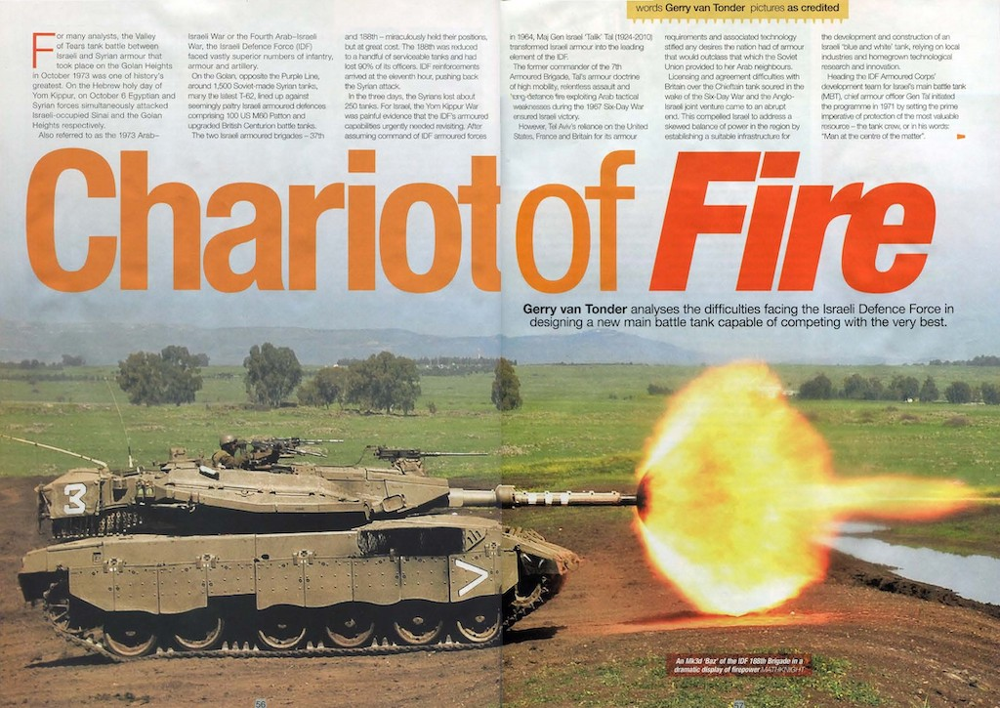

## Books

### Irgun: Revisionist Zionism 1931–48

::: columns
::: {.column width="35%"}

{width=200}
:::

::: {.column width="65%" .justify}
In October 1944, the US Office of Strategic Services described the *Irgun Tsvai Leumi*—
National Military Organization—as “an underground, quasi-military organization with
headquarters in Palestine … fanatical Zionists who wish to convert Palestine and Transjordan
into an independent Jewish state … advocate the use of force both against the Arabs and the
British to achieve this maximal political goal.”
In 1925, Ze’ev Jabotinsky founded the Revisionist Zionism organization, whose non-
religious, right-wing ideology would lead to the formation of the Irgun and, ultimately, of the
Likud Party.
:::

::: {.justify}
Commencing operations in the British Mandate of Palestine in 1931, Irgun adopted a
mainly guarding role, while facilitating the ongoing immigration of Jews into Palestine. In
1936, Irgun guerrillas started attacking Arab targets, killing more than 250 by the end of the
Second World War. The British White Paper of 1939 rejected the establishment of a Jewish
nation and, as a direct consequence, Irgun guerrillas started targeting the British.

The authorities executed captured Irgun operatives found guilty of terrorism, while
deporting hundreds to internment camps overseas. As details of Jewish genocide—the
Holocaust—emerged, Irgun declared war on the British in Palestine. Acts of infrastructural
sabotage gave way to the bombing of buildings and police stations, the worst being the
bombing of the King David Hotel in Jerusalem—the hub of British operations and
administration—in July 1946, killing 91.

Freedom fighters or terrorists, Irgun was only dissolved when the independent Jewish
state of Israel was born on 14 May 1948. This is their story.

Publisher: ‎Pen & Sword Military (11 February 2019)

Paperback and Kindle:‎ 128 pages

ISBN:  9781526728692

[Amazon](https://www.amazon.co.uk/Irgun-Revisionist-Zionism-1931-1948-History/dp/1526728699)
[Pen & Sword](https://www.pen-and-sword.co.uk/Irgun-Paperback/p/15999)

:::

:::

## Magazine articles

### Chariot of Fire: Israeli Merkava Tank
#### Classic Military Vehicle March 2022

::: {.justify}

For many analysts, the Valley of Tears tank battle between Israeli and Syrian armour that took
place on the Golan Heights in October 1973 was one of history’s greatest. On the Hebrew
holy day of Yom Kippur, on 6 October Egyptian and Syrian forces simultaneously attacked
Israeli-occupied Sinai and the Golan Heights respectively.

Also referred to as the 1973 Arab–Israeli War, or the Fourth Arab–Israeli War, the
Israeli Defence Force (IDF) faced vastly superior numbers of infantry, armour and artillery.
On the Golan, opposite the Purple Line, around 1,500 Soviet-made Syrian tanks, many the
latest T-62, lined up against seemingly paltry Israeli armoured defences comprising 100 US
M60 Paton and upgraded British Centurion battle tanks.

The two Israeli armoured brigades—37th and 188th—miraculously held their
positions, but at great cost. The 188th was reduced to a handful of serviceable tanks and had
lost 90 per cent of its officers. IDF reinforcements arrived at the eleventh hour, pushing back
the Syrian attack. In the three days the Syrians lost about 250 tanks. For Israel, the Yom
Kippur War was painful evidence that the IDF’s armoured capabilities urgently needed
revisiting.

After assuming command of IDF armoured forces in 1964, Major General Israel
‘Talik’ Tal (1924–2010) transformed Israeli armour into the leading element of the IDF.
Former commander of the 7th Armored Brigade, Tal’s armour doctrine of high mobility,
relentless assault and long-distance fire exploiting Arab tactical weaknesses during the 1967
Six Day War ensured Israeli victory.

However, Tel Aviv’s reliance on the United States, France and Britain for its armour
requirements and associated technology stifled any desires the nation had of armour that
would outclass that which the Soviet Union provided to her Arab neighbours.
This compelled Israel to address a skewed balance of power in the region by
establishing a suitable infrastructure for the development and construction of an Israeli ‘blue
and white’ tank, relying on local industries and homegrown technological research and
innovation.

Heading the IDF Armored Corps’ development team for Israel’s own main battle tank
(MBT), Chief Armor Officer General Tal initiated the programme in 1971 by setting the
prime imperative of protection of the most valuable resource—the tank crew, or in his words,
“Man at the centre of the matter”. Firepower would come next in priority, followed by
mobility.

From initial plasticine, fibre-glass and wooden scale models, the prominent design
feature was a state of the art low-profile turret which, like that of the American M60A2 MBT,
had a turret that was narrower than the turret ring.

In pursuance of maximising crew protection, and in what became known as double-
spaced armour, turret protection was based on double walls, with some cavities also
providing storage space for items such as 60mm mortar bombs.
The 62-ton super tank was fitted with a cannon almost identical to the 105mm
L7/M68 rifled gun found on the Centurion Mk5. The decision drew criticism for not being innovative. Not only had the IDF employed this gun for a decade already when upgrading
Pattons and Centurions, but many believed that the new Soviet T-72’s 125mm gun was
superior. A thermal sleeve was fitted to the gun, giving greater accuracy in firing by
providing a more consistent temperature to the gun barrel and so preventing distortions due to
thermal expansion caused by the temperature differences around the barrel when firing.
Rounds for the cannon were stored 6 ready to use just below the turret ring, 12 in two
cylinders at the rear base of the hull, and 44 in 4-round containers at the very rear of the tank.
A blend of the traditional, conventional and innovative, notwithstanding numerous
disappointing features, the Merkava Mk1 was, in the words of Lieutenant Colonel (Res)
Martin Mass of the Armored Corps Memorial Site and Museum (Yad La-Shiryon) at Latrun,

“The very development and self-production of a major combat system for the ground forces
in response to the difficulty of orderly procurement constituted a significant revolution whose
results and impact we see today.”

The first Mk1 prototype was completed in 1974, followed in 1977 by the
commencement of the initial production of the first batch of 40 tanks. Full-scale production
started in 1979 when it was officially adopted by the IDF, and ceased in 1983 after 250 had
been built. In 1982, production commenced on the Merkava Mk2 and lasted until 1989 after
580 were built.

The Merkava Mk3 first appeared in the public domain in 1989. Although production
ceased in 2003 after 780 had been built, this version is still widely employed by the IDF.
Maintaining its philosophy of affording tank crews optimum protection, the Mk3 had added
passive modular armour, which could be easily replaced in the field.

In 2018, the IDF Armored Corps unveiled the highly advanced Merkava Mk4 ‘Barak’
variant, employing artificial intelligence for the first time to assist the crew with intricate
aspects of combat management. Virtual reality simulation using the innovative ‘Iron View’
helmet optimises crew training beyond compare.

:::