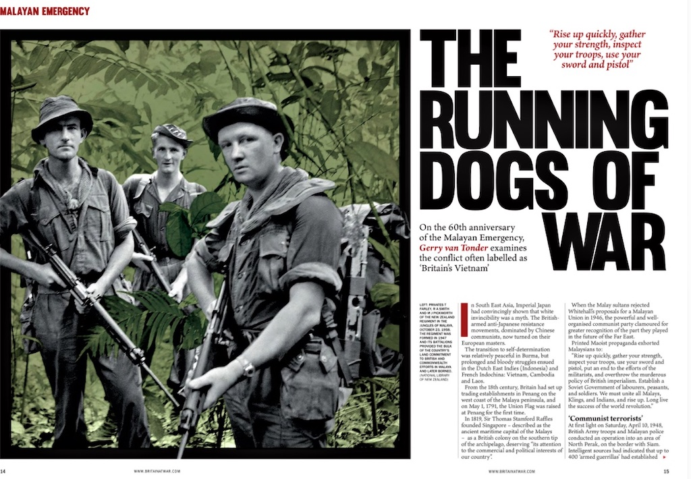

## Books

### The Berlin Blockade: Soviet Chokehold on Berlin and the Great Allied Airlift 1948–49

::: columns
::: {.column width="35%"}

{width=200}
:::

::: {.column width="65%" .justify}
With a pathological hatred of the other’s ideology that had spawned total mistrust, the paucity
of belief in a non-aggression pact between Adolf Hitler and Joseph Stalin in a short space of
time catapulted the two nations into a bitter conflagration of Biblical proportions. As
Montgomery struggled to shake the sand of the Normandy beaches off his boots, followed by
major setbacks in the Ardennes and at Arnhem, the Red Army brutally wiped out the Fuhrer’s
seat of power. Allied agreements entered into at Teheran, Yalta and Potsdam for the carving up of
post-war Berlin now meant nothing to the Soviet conquerors.
:::

::: {.justify}
Their victory cost millions ofRussian lives – troops and civilians – so the hammer and sickle hoisted atop the Reichstag
was more a claim to ownership than success.

Moscow’s agenda was clear and simple: the Western Allies had to leave Berlin
peacefully or by escalating pressure. The blockade ensued as the Russians orchestrated a
determined programme of harassment, intimidation, flexing of muscle, and Socialist
propaganda to force the Allies out.

Britain and America would not be cowed. History’s largest airborne relief programme
was introduced to save the beleaguered city. Truman had already used the atomic weapon
with unprecedented results, while Stalin amassed enormous armies east of the Iron Curtain.
In a war of attrition, diplomatic bluff and backstabbing, and mobilising of forces, the West
braced itself for a third world war.

This account is drawn entirely from the British press of the day.

Publisher: ‎Pen & Sword Military (2017)

Paperback: 128 pages

ISBN:  9781526708267

[Amazon](https://www.amazon.co.uk/Berlin-Blockade-Cold-Gerry-Tonder/dp/1526708264)
[Pen & Sword](https://www.pen-and-sword.co.uk/Berlin-Blockade-Paperback/p/13310)

:::
:::

### Malayan Emergency: Triumph of the Running Dogs 1948–1960

::: columns
::: {.column width="35%"}

{width=200}
:::

::: {.column width="65%" .justify}
Staggering under the immeasurable cost of the ‘good fight’, post-war Britain was
immediately confronted with an imploding empire, where overseas territories over which the
Crown held varying levels of control clamoured for self-determination. For predominantly
ethnic Chinese radical activists, this translated as Merdeka—independence—for a
conglomerate of states, sultanates and islands that London referred to as British Malaya. By the time of the Second World War, Japanese occupation of the Malay Peninsula
and Singapore, the Malayan Communist Party (MCP) had already been working on freedom
from Britain. The Japanese conquerors, however, were also the loathsome enemies of the
MCP’s ideological brothers in China.
:::

::: {.justify}
An alliance of convenience with the British was the outcome. Britain armed and
trained the MCP’s military wing, the Malayan People’s Anti-Japanese Army (MPAJA), to
essentially wage jungle guerrilla warfare against Japanese occupying forces.
With the cessation of hostilities, anti-Japanese became anti-British and, using the
same weapons and training fortuitously provided by the British army during the war, the
MCP launched a guerrilla war of insurgency.

Malaya was of significant strategic and economic importance to Britain. In the face of
an emerging communist regime in China, a British presence in Southeast Asia was
imperative. Equally, rubber and tin, largely produced in Malaya by British expatriates, were
important inputs for British industry.

Typically, the insurgents, dubbed communist terrorists, or simply CTs, went about
attacking soft targets in remote areas: the owners, managers and infrastructure of the rubber
plantations and tin mines. In conjunction with this was the implementation of Chairman
Mao’s dictate of subverting the rural, largely peasant rural population to the cause.
Twelve years of counter-insurgency operations ensued, as a wide range of British
forces were joined in the conflict by ground, air and sea units from Australia, New Zealand,
Southern Rhodesia, Fiji, Nyasaland and Northern Rhodesia.

Publisher: ‎Pen & Sword Military (2017)

Paperback: 128 pages

ISBN:  9781526707864

[Amazon](https://www.amazon.co.uk/Malayan-Emergency-Cold-Gerry-Tonder/dp/1526707861)
[Pen & Sword](https://www.pen-and-sword.co.uk/Malayan-Emergency-Kindle/p/13907)

:::
:::

### Red China: Mao Crushes the Kuomintang, 1949

::: columns
::: {.column width="35%"}

{width=200}
:::

::: {.column width="65%" .justify}
It is 30 years since the end of the Cold War. It began over 75 years ago, in 1944 long before
the last shots of the Second World War had echoed across the wastelands of Eastern Europe
with the brutal Greek Civil War. The battle lines are no longer drawn, but they linger on,
unwittingly or not, in conflict zones such as Syria, Somalia and Ukraine. In an era of mass-produced AK-47s and ICBMs, one such flashpoint was China in 1949 when two vast armies prepared for a final showdown that would decide Asia’s future. One is led by Mao Tse-tung and his military strategists Zhou Enlai and Zhu De. Hardened by years of guerrilla warfare, armed and trained by the Soviets, and determined to emerge victorious, the People's Liberation Army is poised to strike from its Manchurian stronghold.
:::

::: {.justify}
Opposing them are the teetering divisions of the Kuomintang, the KMT. For two decades, Chiang Kai-shek’s nationalist regime had sought to fashion China into a modern
state. But years spent battling warlords and enduring Japan s brutal conquest of their
homeland had left the KMT weak, corrupt and divided.

Millions of Chinese perished during the crucible of the Sino-Japanese War and the
long, gruelling years of the Second World War. But the Soviet victory against the Japanese
Kwantung Army in 1945 allowed Mao’s communists to re-arm and prepare for the coming
civil war. Within a few short years, the KMT were on the defensive while the Communists
possessed the most formidable army in East Asia. The stage was set for China’s rebirth as a
communist dictatorship ruled by a megalomaniac who would become the biggest mass-
murderer in history.

Publisher: ‎Pen & Sword Military (2018)

Paperback: 128 pages

ISBN:  9781526708106

[Amazon](https://www.amazon.co.uk/Red-China-Crushes-Chiangs-Kuomintang/dp/1526708108)
[Pen & Sword](https://www.pen-and-sword.co.uk/Red-China-Paperback/p/14330)

:::
:::

### Sino–Indian War: Border Clash October–November 1962

::: columns
::: {.column width="35%"}

{width=200}
:::

::: {.column width="65%" .justify}
For a hundred years, British and Chinese territorial claims in the Himalayas were in dispute,
with Indian historians claiming that the region was the fountainhead of Hindu civilization. In
the halcyon days of the British Raj, London saw Afghanistan and Tibet as buffers from
Russian and Chinese imperialism. In 1913, an ephemeral agreement between Britain, Tibet and China was signed, recognizing the McMahon Line as the border of the disputed territory. China, however, failed
to ratify the agreement, while India protested against a loss of historical land.
:::

::: {.justify}

After the Second World War, India became independent of Britain and the Chinese
Communists proclaimed a people’s republic. Despite cordial overtures from Indian Prime
Minister Nehru, in late 1950 the Chinese People’s Liberation Army (PLA) invaded Tibet.
In the ensuing twelve years, Indian diplomacy and Chinese ‘cartographic aggression’
were punctuated by incidents along the border, particularly in 1953 when armed clashes
precipitated a significant increase in the disposition of troops by both sides.
In the spring of 1962, Indian forces struck into the Ladakh region of the state of
Jammu and Kashmir, hoping to push the Chinese back.

In a spiralling game of brinkmanship, in September ground forces were deployed and
redeployed to gain strategic security. On 10 October, 33 Chinese died in a firefight near
Dhola.

Embittered by Moscow’s support of India against a sister communist state, and in a
bid to clip Nehru’s belligerent wings, on 20 October the PLA launched a two-pronged attack
against Indian positions in the region. Ironically, this was at the same time as the Cuban
missile crisis.

Publisher: ‎Pen & Sword Military (2018)

Paperback: 128 pages

ISBN: 9781526728371

[Amazon](https://www.amazon.co.uk/Sino-Indian-War-Border-October-November-1945-
1991/dp/1526728370)
[Pen & Sword](https://www.pen-and-sword.co.uk/Sino-Indian-War-ePub/p/15509)

:::
:::

## Magazine articles

### The Running Dogs of War: Malayan Emergency 1948–1960
#### Britain at War December 2020

::: {.justify}

From the 18th century, Britain had set up trading establishments in Penang on the west coast
of the Malaya peninsula, and on May 1, 1791, the Union Flag was raised at Penang for the
first time. In 1819, Sir Thomas Stamford Raffles founded Singapore—described as the
ancient maritime capital of the Malays—as a British colony on the southern tip of the
archipelago, deserving “its attention to the commercial and political interests of our country”.

By 1921, 1.3 million acres of Malaysia was under rubber, mainly on the Malayan
peninsula. Of this acreage, expatriate Europeans owned 75 per cent of the large, estate
plantations. By 1940, this had spread to over 2.1 million acres.

When the Malay sultans rejected Whitehall’s proposals for a Malayan Union in 1946,
the powerful and well-organised communist party clamoured for greater recognition of the
part they played in the future of the Far East. Successive attempts by the British to devolve
greater political and administrative independence to a union of Malay states and islands were
also shunned. Printed Maoist propaganda exhorted Malaysians to:

*“Rise up quickly, gather your strength, inspect your troops, use your sword and pistol, put an
end to the efforts of the militarists, and overthrow the murderous policy of British
imperialism. Establish a Soviet Government of labourers, peasants, and soldiers. We must
unite all Malays, Klings, and Indians, and rise up. Long live the success of the world
revolution”.*

At first light on Saturday, April 10, 1948, British army troops and Malayan police
conducted an ‘anti-bandit’ operation into an area of North Perak, on the border with Siam.
Intelligent sources had indicated that up to 400 ‘armed guerrillas’ had established themselves
in the border jungles between the two countries. Subversion was found to be total. The
guerrillas had formed a government in the area and were extorting taxes from the people.
Levels of intimidation were such that the villagers refused to cooperate with the authorities
by identifying their Chinese Communist masters. Two months later, escalating guerrilla
activities forced the British administration to declare a state of emergency in Malaya.
About 90 per cent of the communist terrorists, or CTs as they would commonly be
called, were ethnic Chinese, the balance mainly Malay and Indian, with one or two Siamese,
Japanese and Javanese. Generally young, the CTs were jungle habituated, attuned to the lay
of the land in which they operated. Hardened survivalists, they understood deprivation and
the necessity of living off the jungle. Their fieldcraft and tracking skills were, for the
majority, second nature in the familiar environment.

The CTs employed simple tactics in the model of Mao Zedong’ s rural revolution:
swift, random, hit-and-run attacks that were brutal in the extreme. Murder and terror would
be the norm. The CTs’ biggest advantage in the jungle battleground was the element of
surprise, where ambush-encompassed killing zones could be meticulously laid out for
optimum results.

In 1950, Chief of the Imperial General Staff, Field Marshall Bill Slim, appointed
Lieutenant General Sir Harold Briggs KCIE, KBE, CB, DSO and two Bars, as Director of Operations in Malaya. The retired Briggs was a Second World War veteran of the Western
Desert, East Africa, Persia and Burma theatres of war.

His name would become synonymous with the forced resettlement of rural
populations into guarded internment camps in Malaya to deprive the insurgents of local
support such as food and intelligence. Likely a strategy copying that employed so tragically
by the British during the Second Boer War in South Africa, in later years Briggs’s model of
isolation through collectivisation of a rural population would be emulated by Portugal in her
African colonies, called aldeamentos, and by the widespread construction of protected
villages by the Rhodesian government during that country’s counter-insurgency war of the
1970s. A legally questionable strategy, it was to be a major contributing factor to Britain’s
victory over the MNLA.

As early as 1950, it had already become apparent to the British media that, by simple
interpretation of the statistics, Britain’s fiscus was under tremendous strain putting out fires
in, among others, Palestine, Berlin and Malaya. Military success measured in terms of kill
rates as a ratio to loss of own forces made uncomfortable, if not pitiful, reading.
Public opinion, therefore, tended to agree with Commissioner General Malcolm
MacDonald who was quoted as saying, “Only a fool would say the situation is getting better,”
a comment that was at direct variance with that of the late High Commissioner Sir Henry
Gurney who believed that there was no doubt that the government was making good progress
in the ‘the bandit war’.

There was no ceasefire. ‘Running Dogs’ was the derogatory term used by the
Malayan communists when referring to the British and those of the colony’s population who
remained loyal to Britain.

With the independence of Malaya on August 31, 1957, the communists’ raison d'être
for their ‘liberation struggle’ evaporated. The last significant engagement with CTs took
place in a swamp in the Telok Anson area of Perak in 1958, resulting in the guerrillas
surrendering. Small, scattered groups of CTs sought refuge across the Thai border and
beyond.

On July 31, 1960, the state of emergency was declared over. Chin Peng left Thailand
for Beijing, where the Chinese International Liaison Bureau provided him and other
Southeast Asian revolutionaries with a roof over their heads.
Britain, the lesson learned, sensibly stayed out of Vietnam, electing instead to
concentrate on NATO and the Cold War threat in Europe.

:::

### Soviet Armour Graveyard, Afghanistan
#### Classic Military Vehicle November 2021

::: {.justify}

In October 1979, factional communist rival and Afghan Minister of Foreign Affairs,
Hafizullah Amin, ordered the assassination of the Afghan president, communist Taraki Nur
Mohamed, founder member of the People's Democratic Party of Afghanistan (PDPA) that had
seized power a year earlier.

Amin assumed power, but Moscow labelled him “a power-hungry leader who is
distinguished by brutality and treachery,” whose dealings with the Kremlin were insincere
and duplicitous. For long reluctant to respond to Amin’s appeals for assistance, or to
intervene directly, Soviet leader Leonid Brezhnev and the Politburo, driven by growing
concerns that the Soviet was going to lose control over a region of strategic interest, decided
to act.

Following a phased, relatively limited deployment of troops and assets over several weeks,
on December 27, 1979, Soviet airborne forces attacked the Presidential Palace in Kabul,
during which Amin was killed. The Soviets replaced him with Karmal Babrak, and over the
next two days the Soviet Fortieth Army, commanded by Lieutenant General Yuri Tukharinov,
invaded Afghanistan. The force comprised three motor rifle divisions (MRD) and the 103rd
Airborne Division.

All the while, the counter-revolutionary Mujahideen, aided by Pakistan, Iran and the
USA, continued to increase their armed activities against anyone or anything—especially the
Amin regime—that represented a threat to their centuries-old socio-political existence centred
on family, tribe and religion. Any semblance of national unity has historically been the
consequence of outsiders trying to impose alien rule on the country, such as the nineteenth
century British.

Although largely untrained, the hardy Mujahideen were thoroughly accustomed to the
use of weapons in a part of the world where conflict resolution through the barrel of a gun
was endemically ingrained in their lives.

The main weapons of the Mujahideen had to be compatible with the mobile tactics of
guerrilla warfare. They were therefore equipped with the ubiquitous AK-47 assault rifle, PK
light machine guns and the RPG-7 anti-tank rocket grenade launcher. The employment of
60mm, 82mm, and sometimes 107mm mortars, 82mm recoilless anti-tank guns, BM-1 single
107mm rocket launchers, and 7.62mm and 12.7mm heavy machine guns became more
widespread. These tribal fighters were also enthusiastic proponents of landmine warfare,
which the Soviets discovered at their expense, losing 1,191 vehicles and 1,995 men to mines.

Very little of Afghanistan’s terrain is suited to mechanised warfare, that relied on
unhindered manoeuvrability and superior firepower, and in fact, provided the Mujahideen
with an enormous strategic advantage. There were no railways and only 11,000 miles of
roads, of which only one sixth was paved. The national Afghan Army was largely unable—or
disinclined—to take on the warlords. This was the start of a ten-year occupation. Four years later, to the day, ABC World News presenter Peter Jennings reported with remarkable foresight:

*“Four years after the Soviet invasion of Afghanistan, an unwinnable war drags on,
unwinnable for either side. These are some of the Afghan guerrillas who prevented a Soviet
victory, but they've not prevented Soviet domination.*

*“There are slightly more than 100,000 Soviet troops in Afghanistan, which is about
the size of Texas. U.S. intelligence estimates it costs the Soviets about $3 billion. Why, after
four years, have the Soviets not done better? First they miscalculated because they couldn't
control the Communist regime that took over in 1978, and then they miscalculated in 1979
because they thought that they could be in for six months and stabilize things and leave. What
superpowers often do, they forget that the mere presence of foreign soldiers in other countries
becomes the main issue.”*

By 1984, the American Central Intelligence Agency CIA) estimated that, since the
invasion of Afghanistan in 1979, the Soviets had suffered roughly 25,000 casualties,
including about 8,000 killed. They had lost over 600 helicopters and fixed-wing aircraft, and
thousands of armoured vehicles and trucks. Casualties in the Afghan Army were around
67,000 and insurgent casualties at some 40,000. Analysts would describe the conflict as “the
Soviet Union’s Vietnam War.”

Between 1980–85, Soviet forces in Afghanistan lost 655 armoured vehicles and 340
tanks, and a staggering 5,250 tracks for armoured vehicles. Landmines, often stacked in
threes, and remotely detonated explosive devices exacted a major toll on Soviet armour.
According to the same 1987 CIA report mentioned above, the Soviets deployed an estimated
40 T-54/55 and 690 T-62 main battle tanks (MBTs).

By the late 1980s, there was mounting criticism of the Afghan war in the Soviet
media and by the man in the street, likening the conflict to the disastrous Vietnam War. Early
in 1987, the demobilisation of Soviet conscripts in Afghanistan commenced. This was
followed by the Fortieth Army starting their official withdrawal in May 1988, and in
February 1989, the last Soviet troops left.

On February 11, 1989, as the massive convoy of the Soviet Army Western
Afghanistan Division trundled through the Afghan border town of Towraghondi and into the
Soviet Union, armoured assault leader Lieutenant Viktor Yevdokimov said to accompanying
British journalist Arthur Kent, “We could have tried anything, and the outcome would have
been the same. It’s time to go home.”

And right now, 32 years later, Britain and the United States are also withdrawing their
troops from that eclectic amalgam of fiercely zealous tribes and warlord polities that the rest
of the world calls Afghanistan.

:::