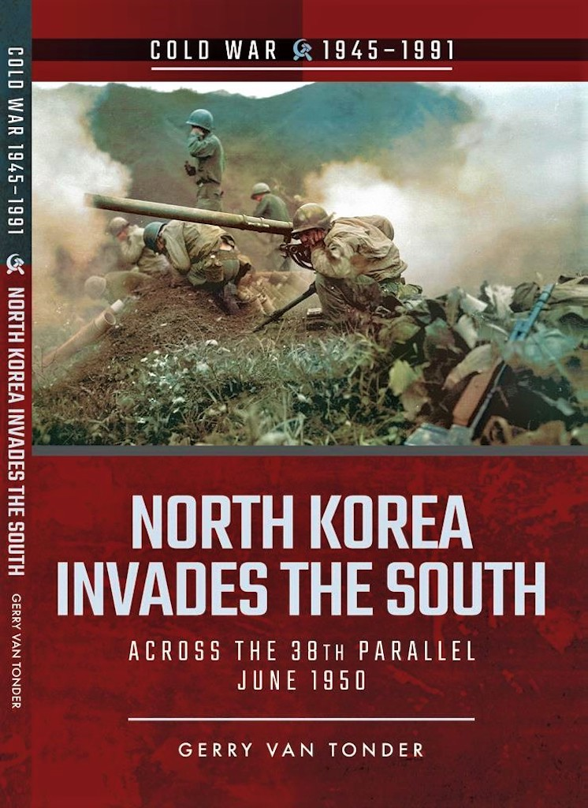
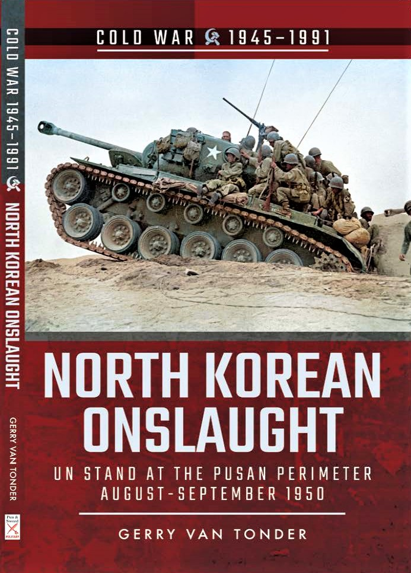
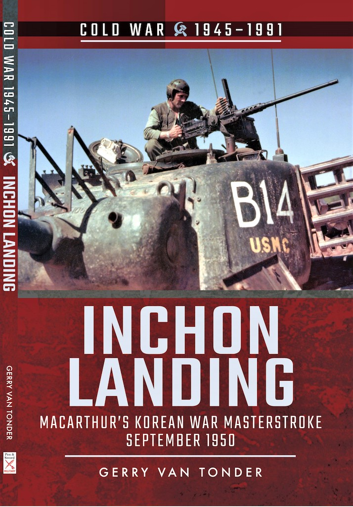
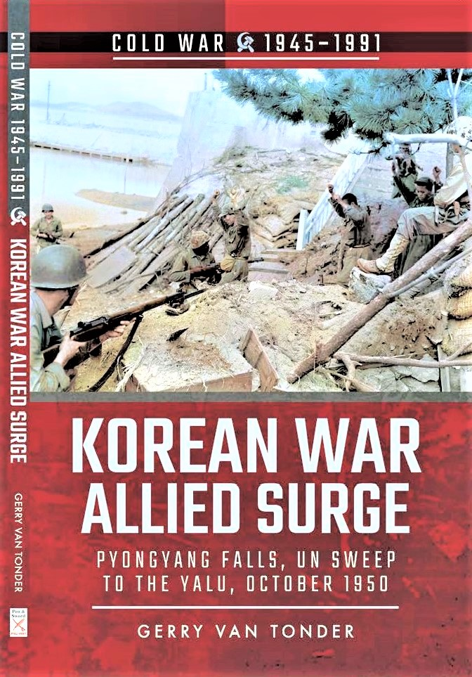
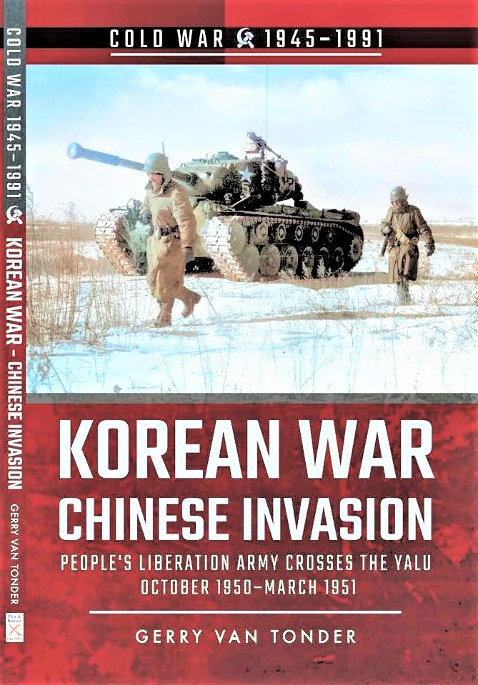
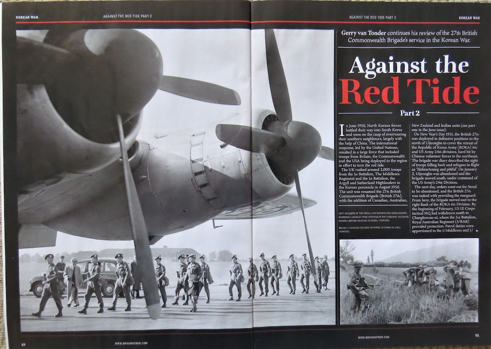

## Books

### North Korea Invades the South: Across the 38th Parallel June 1950

::: columns
::: {.column width="35%"}

{width=200}
:::

::: {.column width="65%" .justify}
The attack upon South Korea made it plain beyond all doubt that communism had passed
beyond the use of subversion to conquer independent nations and would now use armed
invasion and war. A week after his reaction to the North Korean invasion south across the 38th Parallel, US President Harry S. Truman, in compliance with a UN Security Council resolution,
appointed that iconic Second World War veteran, General Douglas MacArthur, commander-
in-chief of forces in Korea.
:::

::: {.justify}
Without warning, at 4.00 a.m. on 25 June 1950, North Korean artillery laid down a
heavy bombardment on the Ongjin Peninsula, followed four hours later by a massive
armoured, air, amphibious and infantry breach of the ill-conceived post-war ‘border’ that was
the 38º North line of latitude. At 11.00 a.m. North Korea issued a declaration of war on the
Republic of Korea. Three days later, the South Korean capital, Seoul, fell.

In August 1945, the capitulation of the Japanese precipitated a hastily agreed-to
delineation of American and Soviet zones of occupation on the Korean peninsula, pending a
merging of the two Koreas into a single, unified state. By the summer of 1948, tensions
escalated dramatically between north and south, the former adamant that South Korea
belonged to them.

The unprepared and understrength American Far East Command in Japan rapidly
airlifted combat elements of the US 24th Division to avoid a total rout in Korea at the hands
of the committed North Korean supremo, Marshal Choi Yung Kun. Within days, British
Prime Minister Clement Attlee placed the Royal Navy in Japanese waters at Truman’s
disposal. The decisions by the two erstwhile war allies, to act in accordance with a UN
mandate for the use of force was, however, not fully endorsed by their respective legislatures
or electorates—wounds from the just-ended global conflict were still raw.

Whilst blaming the hostilities on South Korea and ‘all who stand behind their back’,
the Soviets formally declared that they would adhere to the principle of non-interference by
foreign powers in the internal affairs of Korea.

The first in a six-volume series on the Korean War, this publication considers those
first few fateful days in June 1950 that would cement north-south antagonism to this day, the
pariah state that is communist North Korea a seemingly increasing threat to an already
tenuous global peace in the Cold War era.

Publisher: ‎Pen & Sword Military (2018)

Paperback: 128 pages

ISBN:  9781526708182

[Amazon](https://www.amazon.co.uk/North-Korea-Invades-South-1945-1991-ebook/dp/B078XTRPYQ)
[Pen & Sword](https://www.pen-and-sword.co.uk/North-Korea-Invades-the-South-Paperback/p/14524)

:::

:::

### North Korean Onslaught: UN Stand at Pusan August–September 1950

::: columns
::: {.column width="35%"}

{width=200}
:::

::: {.column width="65%" .justify}
In the first volume in this series on the Korean War, North Korea Invades the South, North
Korean ground forces, armour and artillery crossed the 38th Parallel, and, in blitzkrieg style,
roll back US and South Korean forces down the Korean peninsula.Despite the United States and South Korea committing army, air force and navy units,supported by forces from Australia, Britain, New Zealand, France and Canada, by 31 July eleven North Korean divisions were concentrated in a disconnected line from Chŏnju to Yŏngdong.
:::

::: {.justify}
Along the south coast, the North Koreans pushed eastwards towards Masan. To the
east and centre of the peninsula, they closed in on Kimch’ŏn and the Naktong River line. On
the east coast, three North Korean divisions secured the Yŏngdŏk–P’ohang axis, placing them
within mortar range of the UN Yŏnil Airfield.

Reeling back, the UN forces desperately defended the 140-mile line lodgement area
that incorporated the port of Pusan (now Busan). Supreme commander of the UN forces,
General Douglas MacArthur, had his back to the sea, facing thirteen enemy infantry
divisions, two new tank brigades and an armoured division.

On 1 September, North Korean forces launched their strongest offensive to date, and
in the first two weeks of the month American casualties were the heaviest of the war. Of
particular concern to the commander of the US Eighth Army, Lieutenant General Walton
Walker, was the danger of losing the town of Taegu in the centre. The resultant loss of the
strategic Taegu–Pusan railway would be catastrophic.

MacArthur and Washington were running out of options, but the Pusan Perimeter had
to be defended at all costs.

Publisher: ‎Pen & Sword Military (2018)

Paperback: 128 pages

ISBN:  9781526728338

[Amazon](https://www.amazon.co.uk/North-Korean-Onslaught-Perimeter-August-September-
ebook/dp/B07QCCPCFC)
[Pen & Sword](https://www.pen-and-sword.co.uk/North-Korean-Onslaught-ePub/p/16562)

:::

:::

:::

### Inchon Landing: MacArthur’s Korean War Masterstroke, September 1950

::: columns
::: {.column width="35%"}

{width=200}
:::

::: {.column width="65%" .justify}
In the first two volumes in the author’s series on battles of the Korean War, North Korean
ground forces, armour and artillery crossed the 38th Parallel into South Korea, inflicting
successive ignominious defeats on the ill-prepared US-led UN troops as they pushed them
ever southward into a tiny defensive enclave—the Pusan Perimeter—on the tip of the Korean
Peninsula. General Douglas MacArthur, Second World War veteran of the South East Asia and
Pacific theatres of war, met with considerable resistance to his plans for a counteroffensive from both the corridors of power in Washington and from his staff
:::

::: {.justify}
in South Korea and Japan: it was typhoon season, the approaches to the South Korean port city of Inch’ŏn were not conducive to amphibious assault, and it would leave the besieged Pusan Perimeter in great
danger of being overrun.

However, the controversial MacArthur’s obstinate persistency prevailed, and with a
mere three weeks to go, the US X Corps was activated to execute the invasion on D-Day: 15
September 1950.

Elements of the US Marine Corps landed successfully on the scheduled day, and with
the element of surprise on their side, immediately struck east to Seoul, only 15 miles away.
The next day, General Walker’s Eighth Army broke out of the beleaguered Pusan Perimeter
to complete the southerly envelopment of North Korean forces.

Seoul fell on the 25th. MacArthur’s impulsive gamble had paid off, and the South
Korean government moved back to their capital. The North Koreans had been driven north of
the 38th Parallel, effectively bringing to an end their invasion of the south that started on 25
June 1950.

Publisher: ‎Pen & Sword Military (2019)

Paperback: 128 pages

ISBN:  9781526756961

[Amazon](https://www.amazon.co.uk/Inchon-Landing-MacArthurs-Masterstoke-
September/dp/152675696X)
[Pen & Sword](https://www.pen-and-sword.co.uk/Inchon-Landing-Paperback/p/16226)

:::

:::

:::

### Allied Surge: Pyongyang Falls, UN Sweep to the Yalu October 1950

::: columns
::: {.column width="35%"}

{width=200}
:::

::: {.column width="65%" .justify}
In the author’s first three volumes in a series on battles of the Korean War, North Korean
forces illegally cross the 38th Parallel, rolling back US and South Korean forces into a small
corner of the Korean peninsula. Months later, commander of the United Nations Command
(UNC) forces in Korea, General Douglas MacArthur, launches a daring counter-offensive
invasion at Inch’ŏn, enveloping North Korean forces and liberating Seoul. Despite a warning from Beijing that it would intervene if US forces crossed the 38th, MacArthur used the UN’s conditional authorization to land elements of the US X Corps at Wonsan and Riwon in North Korea.
:::

::: {.justify}
The Eighth Army and South Korean forces captured the North Korean capital, P’yŏngyang, while American paratroops made the first combat jump of the conflict at Sunch’ŏn and Sukch’ŏn, cutting the road to the Chinese border.

Towards the end of September, the 3rd Battalion, The Royal Australian Regiment (3
RAR), arrived for attachment to the 27th British Commonwealth Brigade, joining the first
battalions of the Middlesex Regiment, Argyll and Sutherland Highlanders and Leicestershire
Regiment.

While MacArthur’s ground forces edged closer to the Yalu River, and the general
having designs of chasing the retiring North Koreans across the river into China, in October
1950 the Chinese politburo deployed 200,000 members of the 13th Army Group of the newly
titled People’s Volunteer Army (PLA) on a pre-emptive ‘defensive’ operation into North
Korea.

Albeit that the Soviet Union refused to become directly involved in the Korean fight,
the imminent arrival of more than a million Chinese troops onto the North Korean battlefield
would inexorably tilt the outcome against the UN forces as fierce battles ensued. The
resultant fallout would manifest itself on the Korean Peninsula to this day.

Publisher: ‎Pen & Sword Military (2019)

Paperback: 128 pages

ISBN:  9781526756923

[Amazon](https://www.amazon.co.uk/Korean-War-Pyongyang-October-1945-1991/dp/1526756927)
[Pen & Sword](https://www.pen-and-sword.co.uk/Korean-War-Allied-Surge-Paperback/p/16755)

:::

:::

### China Invasion: People’s Liberation Army Crosses the Yalu October 1950–March 1951

::: columns
::: {.column width="35%"}

{width=200}
:::

::: {.column width="65%" .justify}
In his first four volumes on the Korean War, the author looked at the North Korean invasion
of the south, which pushed back UN forces under General Douglas MacArthur into the Pusan
enclave on the southeast tip of the Korean peninsula. Following a daring and highly
successful amphibious counterattack at Inch’ŏn, MacArthur liberates Seoul before
confidently crossing the 38th Parallel into North Korea, with the objective of totally
eliminating the North Korean military machine right up to the Chinese Manchurian border.
:::

::: {.justify}
Communist Chinese forces, that had been secretly infiltrating North Korean territory
by slipping across the Yalu River from mid-October, ambushed a South Korean regiment in
the mountains of central North Korea. This would be the first of several Chinese victories
over unsuspecting and overstretched South Korean and American units in the winter of
1950–51.

Chinese leader Mao Zedong, ostensibly fearful of the consequences of hostile
American forces on his country’s border along the Yalu River, ordered hundreds of thousands
of his soldiers into battle in Korea, with express orders to annihilate the UN forces.

In the western half of the theatre, US General Walton H. Walker’s Eighth Army front
along the Ch’ŏngch’ŏn axis was breeched, while to the east the US X Corps suffered a series
of crushing defeats, including at the Chosin Reservoir, precipitating a massive evacuation
from the North Korean port of Hungnam.

American superiority in the Korean War now deteriorated rapidly, as hopes of
imminent victory gave way to a desperate struggle for survival against seemingly endless
numbers of well-equipped Chinese hordes.

Publisher: ‎Pen & Sword Military (2020)

Paperback: 128 pages

ISBN:  9781526778093

[Amazon](https://www.amazon.co.uk/Korean-War-Liberation-1950-March-1945-1991/dp/1526778092)
[Pen & Sword](https://www.pen-and-sword.co.uk/Korean-War-Chinese-Invasion-Paperback/p/17697)

:::

:::

## Magazine articles

### Against the Red Tide Part 1: 27th British Commonwealth Brigade’s Korean War
#### Britain at War Jun 2020

::: {.justify}
On June 25, 1950 the China and USSR-backed North Korean forces invaded South Korea,
sparking a major conflict, the effects of which were felt around the world. The United
Nations – including Britain and many Commonwealth countries – rallied to support the Seoul
government, sending men and equipment in an effort to turn the ‘red tide’. The war raged for
three years and at least two-and-a-half million people lost their lives – the true figure, which
will never be known, is certainly much higher.

Around 2,000 British troops from the 1st Battalion, the Middlesex Regiment, and the
1st Battalion, the Argyll and Sutherland Highlanders, sailed from Hong Kong for the 1,200-
mile voyage across the South China Sea to the war on the Korean peninsula on August 25,
1950. It would take the aircraft carrier HMS Unicorn and the cruiser HMS Ceylon four days
to reach the South Korean port city of Pusan.

The 1st Battalion Argyll and Sutherland Highlanders (1/Argylls), commanded by
Lieutenant-Colonel Leslie Neilson, and the 1st Battalion Middlesex Regiment (1/ Middlesex),
led by Lieutenant-Colonel Andrew Man, had formed the re-activated 27th Infantry Brigade in
1948 under the leadership of Brigadier Basil Coad DSO and Bar. The unit was soon to be
retitled the 27th British Commonwealth Brigade (British 27th), due to the addition of
Canadian, Australian, New Zealand and Indian units. On arrival in South Korea it was
immediately moved to the front at Taegu where, on September 2, it was placed under
command of the US 1st Cavalry Division.

Lieutenant General Walton Walker’s threadbare US Eighth Army had been shoved
inexorably back by Kim Il-sung’s Korean People’s Army (KPA) to a fragile toehold on the
extreme south-east tip of the Korean peninsula. Walker had directed a planned withdrawal to
the east of the Naktong River to take a defensive stand on what became known as the Pusan
Perimeter. By mid-September, 140,000 American and Republic of Korea Army (ROKA)
troops held the line: five ROKA divisions in the northern 160-mile front from Taegu to
P’ohang on the east coast and, dug in along the western perimeter, the American 1st Cavalry
and 2nd, 24th and 25th infantry divisions, and the US 1st Provisional Marine and British 27th
brigades.

Following the high-risk but very successful amphibious landing at Inchon on the
Korean west coast on September 15, 1950, the supreme commander of United Nations forces
in Korea, General Douglas MacArthur, regarded Walker’s breakout from the Pusan enclave
as integral to his master plan. Walker’s objective would be to link up with the US X Corps,
which was firmly established on the Inchon beachhead, 180 air miles to the north of the now
besieging North Korean army.

By September 20, US forces had taken and secured all designated objectives east of
the Naktong, including Hill 303 to the north of Waegwan. The US 24th Division, comprising
the 19th, 21st and 34th regiments, and also the British 27th, crossed the Naktong onto high
ground, from where they awaited the signal to commence a westward attack on the Taegu-
Kumchon Taejon-Seoul highway.

On October 9, Gen Walker ordered his Eighth Army to “strike out for Pyongyang
without delay”. From the vicinity of Kaesong, at 9am, the US 1st Cavalry Division,
commanded by Major General Hobart Gay, spearheaded US I Corps across the 38th Parallel
– the border between North and South Korea – pushing north in the centre for Kumchon.
The British 27th then crossed the border, passing through the US 1st Cavalry Division
in the centre to push the advance onto Sariwon. After beating the US 24th Infantry Division
to the city on October 18, the brigade left Sariwon to recommence the march on Pyongyang,
striking out of the division’s left flank. Meanwhile 3/RAR, much to its displeasure, was
ordered west. The Australians were to approach the North Korean capital along the coast.

On October 19 Chinese forces began to cross the Yalu, and from the 25th were
directly involved in the conflict. In the first few days of November, the defeat of ROKA II
Corps at the hands of the Chinese People’s Volunteer Army 38th Corps, north of Tokchon,
had exposed the US I Corps’ right flank, forcing Brigadier Coad to fall back south of the
Chongchon River. Replaced in reserve by the US 21st Regimental Combat Team, Coad had
3/RAR advance to re-establish the river beachhead. The 1/Argylls moved next, followed by
two companies of 1/ Middlesex, reoccupying hill features south of Tangdong and Pakchon. A
period of tank-supported patrolling of the Pakchon area commenced to ensure the line of
communication south, toward the Chongchon, was kept clear. Logistics had become a major
problem.

The situation deteriorated considerably in the first week of December, forcing the
British 27th to withdraw across the Taedong and Pyongyang. It met up with the recently
arrived British 29th (Independent) Brigade. Continuing to retire south, on December 8 the
27th went into US IX Corps' reserve at Sibyon-ni. Three days later, the brigade crossed back
south of the 38th Parallel, arriving at Uijongbu where they remained in US IX Corps reserve.
The 1/Argylls were tasked with protecting corps HQ but by this point the Chinese had broken
off contact with the retreating UN forces in this sector.

Following a relatively peaceful period patrolling and trying to stay warm, the British
27th was ordered to establish a position at the Han River on the southern reaches of the South
Korean capital, Seoul. They would then cover the withdrawal of the US IX Corps.

:::

### Against the Red Tide Part 2: 27th British Commonwealth Brigade’s Korean War
#### Britain at War July 2020

::: {.justify}
On New Year’s Day 1951, the British 27th was deployed in defensive positions to the north
of Uijongbu to cover the retreat of the Republic of Korea Army (ROKA) 6th and US Army
24th divisions, hard hit by Chinese volunteer forces to the northeast. The brigade war diary
described the sight of troops falling back and refugees in flight as “disheartening and pitiful”.
On January 2, Uijongbu was abandoned and the brigade moved south, under command of the
US Army’s 24th Division.

The next day, orders went out for Seoul to be abandoned, and the British 27th was
tasked with providing the rearguard. From here, the brigade moved east to the right flank of
the ROKA 6th Division. By the beginning of February, US IX Corps tactical HQ had
withdrawn south to Changhowan-ni, where the 3rd Battalion, Royal Australian Regiment
(3/RAR) provided protection. Patrol duties were apportioned to the 1/Middlesex and 1/
Argylls, covering the top right and bottom left of the area respectively.

On March 6, now under command of the US 1st Cavalry Division, the British 27th
pushed forward again, with troops from the 2/PPCLI and 3/ RAR spearheading the advance
under heavy enemy mortar fire. At dusk the following day, the two battalions were short of
their objectives, finding themselves on hillsides where they struggled to evacuate the
wounded. Casualties were heavy – the brigade sustained 21 killed and 70 injured.

On March 25, after almost two weeks of inactivity, the British 27th was trucked north
to relieve the US 19th RCT in the Hyon-ni–Kwanan ri area. The brigade continued with its
relatively unopposed offensive, oblivious to the fact that the latest Chinese withdrawal had
been deliberate and part of the communists’ strategy of cyclical phases of attack, withdraw
and re-outfit.

In preparation of their spring offensive, the CPVA 63rd and 64th Corps had been
building up their forces to the front and flanks of the 1st Battalion, Gloucestershire Regiment
(1/Glosters). In one of the most celebrated battles in British military history, the Battle of the
Imjin River, the Glosters effectively ceased to exist between April 22-25, 1951. Surrounded
on Hill 235 and left to defend themselves against impossible odds and next to no resupply,
the soon to be known as ‘Glorious Glosters’ suffered 580 casualties: 58 killed and a
staggering 522 taken prisoner. A further 27 died in captivity.

With the collapse of the ROKA 6th Division during the night of April 22/23, the
British 27th received rushed orders to block the gap to the north of the Kapyong River. The
2/PPCLI, commanded by Lieutenant-Colonel James Stone, was to establish blocking
positions covering the north and northeast brigade sector, centred on Hill 677.

At one minute after midnight on April 26, the title and command of the British 27th
changed. Brigadier Brian Burke handed over to Brigadier George Taylor, commanding officer
of the 28th British Commonwealth Brigade. Before departing for Hong Kong, Burke
presented the brigade flag to Lieutenant-Colonel Ian Ferguson, CO 3/RAR, in recognition of
their great comradeship and the high esteem felt throughout the whole brigade.

The British 27th, with support from 'A' Company, US 72nd Tank Battalion (on
attachment from the US Eighth Army), had prevented superior numbers of Chinese forces
from taking Kapyong, earning an American Presidential Unit citation “for extraordinary
heroism and outstanding performance of combat duties in action against the armed enemy
near Kapyong, Korea, on April 24/25, 1951”.

:::