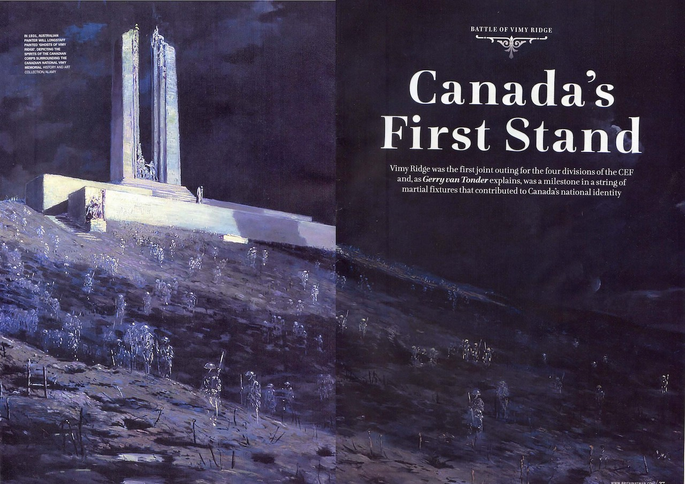
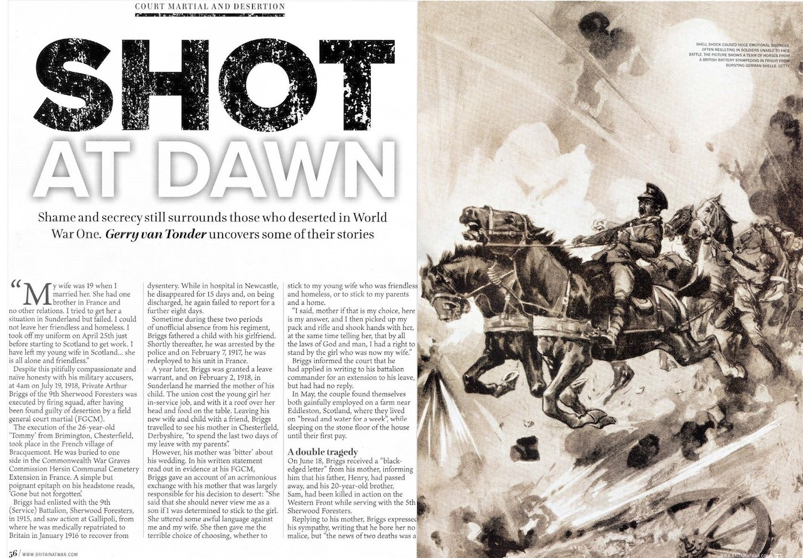

## Magazine articles

### Canada’s First Stand: Battle of Vimy Ridge
#### Britain at War July 2021

::: {.justify}

*“Two minutes; one minute; thirty seconds; men gasped—perhaps a brief prayer. A mighty
roar shook Douai Tunnel and all that trench world, and the stupendous, stunning barrage of 9
April crashed down before the Highland line. In a flicker of time the dawn was raving. A
frantic shower of coloured lights sprayed up through the fog from the German line.”*

Kim Beattie, chronicler of the 15th Battalion, 48th Highlanders (Toronto), 1st
Canadian Division, dramatically portrays the seminal moment in this British dominion’s
history which, in the words of author John Pierce, “came to symbolize Canada's coming of
age as a nation”. The battle was the first occasion when the four divisions of the Canadian
Expeditionary Force (CEF)—titled the Canadian Corps—fought together, and made a symbol
of Canadian national achievement and sacrifice.

At the outbreak of the war, Canada was still 17 years away from being granted
legislative independence by Britain, promulgated by the Statute of Westminster 1931.
Therefore when Britain declared war, Canada found herself at war, even though ‘she had not
been consulted; she had herself made no declaration of war’. But there was never any doubt
that Canada would give her all, as reassuringly expressed by Governor General Field-Marshal
H.R.H. the Duke of Connaught, the Secretary of State for the Colonies, “that if unhappily war
should ensue, the Canadian people will be united in a common resolve to put forth every
effort and to make every sacrifice necessary to ensure the integrity and maintain the honour
of our Empire.”

However, the dominion faced a Herculean task as an ‘unmilitary nation’ with
extremely limited resources and facilities to commit a fully trained and equipped
expeditionary force for active service overseas. As of April 1914, the total authorized
establishment of the permanent force was 3,110 all ranks. Supplementary to this there existed
a ‘Non-Permanent Active Militia’ which, by 1913 stood at around 55,000.

In the Spring of 1917, the German Army High Command accepted the inevitability of
a major French and British offensive, and to shorten the line, took the tactical decision to fall
back from the Arras–Roye Soissons bulge onto the Siegfried Stellung—the Hindenburg Line.
The total destruction of the zone they were vacating would be integral to the withdrawal.
Early in March 1917, Lt Gen Sir Julian Byng, commander of the four-division
Canadian Corps planned for a four-phase attack, each represented by a coloured line on the
map. At an average distance of 750 yards from the Canadians’ front trenches, the Black Line,
together with the enemy forward defences, would be the first objective. The Red Line ran
north along the Zwischen Stellung from the divisional boundary with the 51st (Highland)
Division to a point just south of Petit Vimy. From here, it swung northwest along the right
flank of Hill 145 and Vimy Ridge, to the 24th (British) Division boundary.

This represented the final objective of the 3rd and 4th divisions attacking on Byng’s
left flank. Onhis right, however, the 1st and 2nd divisions would still face two more objectives: the
Blue and Brown lines. The first required capturing the village of Thélus, Hill 135, and the
Bois de Bonval and Count’s woods, thereby securing a commanding position overlooking the village of Vimy. The second objective covered the German Second Line, running through
Farbus Wood, the Bois de la Ville and part of the Bois de Bonval.

By midnight, Easter Sunday, April 8, 1917, along the whole Canadian Corps sector,
thousands of troops of the four divisions, weighed down with combat equipment, moved
forward to take up their respective jump-off positions in the forward trenches. Sleep had been
impossible in the all-consuming pre-battle tension.

Zero hour and the Allied guns commenced a carefully stage-managed rolling barrage
in front of the poised Canadians. Hundreds of Canadian Vickers and Lewis machine guns
swept a zone 400 yards ahead, as the corps troops went over the top on the heels of the
artillery barrage. They surged ahead against a thin rain with intermittent snowfall, focussing
on the first objective, the Black Line the Germans called Zwölfer Weg.

Only threequarters of an hour after zero, the 1st and 2nd divisions had achieved the
Black Line objective. The 3rd Division encountered only light resistance but the 4th Division
faced the greatest difficulties—it would take them several hours to take their first objective.
By 11 April, running for a length of 7,000 yards, and with a depth of 4,000 yards, the
whole of the main part of Vimy Ridge was now securely held by the Canadian Corps. In the
two days of fighting, the Canadians has suffered 2,967 killed and 4,740 wounded. At the end
of war, the 1st and 2nd (Canadian) divisions formed part of the Allied occupation of force of
Germany. The Canadian Corps was demobbed in 1919.

:::

### Shot at Dawn: Deserters in WWI
#### Britain at War August 2021

::: {.justify}

Desertion and punishment statistics emanating from World War One records also reflect
inherent and divergent interpretations of military laws and codes. The Army Act of 1881,
when flogging was abolished, the 1912 edition of the King’s Regulations and the 1914
Manual of Military Law formed the basis of British military law. However, it could never be
envisaged that hitherto unknown prolonged static warfare of industrial proportions lay in the
near future, which would leave military codes largely wanting.

Presiding courts martial officers were often subjective in their understanding of what
constituted desertion, and in the chambers of Westminster, the morality of shooting your own
soldiers for desertion and cowardice polarised the political spectrum.

In April 1930, while hotly debating the issue of the death sentence as a punishment
for desertion in the House of Commons, Secretary of State for War and Labour politician,
Thomas Shaw, contended that the line between what constitutes cowardice and desertion was,
at best, tenuous. Hansard, the official record of parliamentary proceedings, shows Shaw
arguing that the two offences were “manifestations in different form of the same failure of
nerve power or will power”, adding “if you allow the death penalty for desertion to remain
you allow a penalty to remain which was responsible for no less than 92 per cent of the
executions in the last War”.

The Army Council, however, countered the proposed abolishment of the death sentence—of
which, ironically, Shaw was a member—by insisting ‘. . . dreadful and horrible as it is, it is a
sanction which is essential to the discipline of the British Army’.
Pro-capital punishment members of the House, however, believed there was a
plausible ‘essential’ difference between the two crimes. Desertion took place “not in the heat,
turmoil, and horror of the moment of battle, but probably somewhere behind the lines where
the man at the moment of desertion is under peace conditions and safety, and he deserts to
avoid the danger which he knows lies before him if he carries out the dangerous duty which
he has been ordered to do”.

The inference, shared by the Secretary of State for War, but for different reasons, was
that the overwhelming majority of desertion convictions were in fact cases of mental distress,
commonly referred to as ‘cowardice’.

Hansard records Shaw as saying, “There is no romance in mud, vermin, and shell and
shot, where men are destroyed without a possible chance of seeing the enemy they are
fighting. There is no romance in that; it is simply brutality, dirt, disease and death. Where a
man is engaged regularly in the Army you may be right in shooting him for cowardice, but
you have not the same right in the case of civilian volunteers. You have no right to take a man
from the factory or the farm and put him into khaki and a tin hat, and then shoot him if he
shows cowardice”.

First coined during the conflict by British psychologist Charles Myers, the term ‘shell
shock’ was used to describe what would become known as post-traumatic stress disorder,
PTSD. However, it would take decades of medical advances to fully understand the psychological and physiological trauma experienced by so many soldiers during the war—the so-called invisible wounds.

Victims would present symptoms such as uncontrollable anxiety, facial tics, loss of
sight, stomach cramps, hallucinations, and the inability to eat, sleep, walk or talk. Treatment
varied considerably, depending on a medical practitioner’s diagnosis. In many cases, soldiers
with shell shock were belittled as they were not ‘man’ enough to deal with the war. The
imperative was to return the soldier to the frontline as quickly as possible. Others understood
the cause to be as a result of a physical nerve injury, brought on by a soldier enduring
prolonged heavy enemy bombardment.

Using full field court martial documentation for Private Arthur Briggs of the 9th
Sherwood Foresters, I follow his trial, circumstances and execution by firing squad in France
in July 1918. The descendants of Arthur Briggs—and those of all the other 305 men who suffered
the same horrific end of life—had to wait 88 years for the powers that be to recognise that
these executions were wrong.

Janet Booth, granddaughter of Private Harry Farr, who was shot for cowardice in
1916, campaigned and lobbied tirelessly from 1992 until 2006, when Farr’s family eventually
took the British Ministry of Defence to Court. They won their case, and under Section 359,
‘Pardons for servicemen executed for disciplinary offences: recognition as victims of First
World War’, of the newly promulgated Armed Forces Act 2006, every one of these soldiers
shot during the First World War was granted a pardon. The Act does, however, make it clear
that the pardon only applies to the actual execution, and ‘. . . does not lift the convictions or
sentences of the servicemen affected’.

Only a few years earlier, on July 24, 1998, the Minister for the Armed Forces, Dr
John Reid, told the Commons, “There are deeply held feelings about the executions. Eighty
years after those terrible events, we have tried to deal with a sensitive issue as fairly as
possible for all those involved. In remembrance of those who died in the war, the poppy
fields of Flanders became a symbol for the shattered innocence and the shattered lives of a
lost generation. May those who were executed, with the many, many others who were victims
of war, finally rest in peace.”

:::