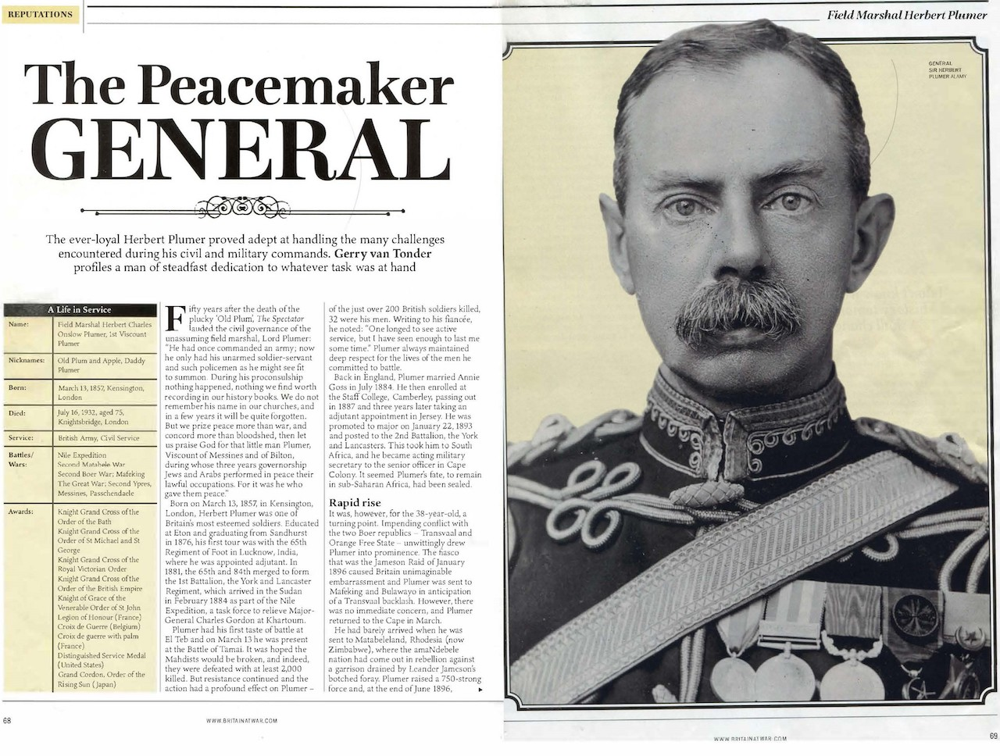
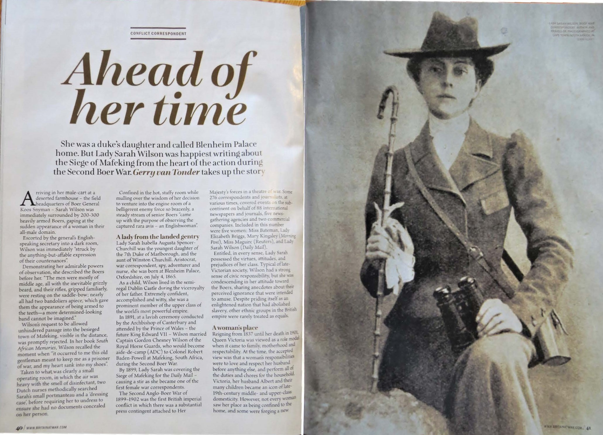

## Magazine articles

### The Peacemaker General: Field Marshall Herbert Plumer
#### Britain at War January 2021

::: {.justify}

Fifty years after the death of the plucky ‘Old Plum’, The Spectator lauded the civilian work
in Palestine of the unassuming field marshal, Lord Plumer:

_A little old man, he had once commanded an army; now he only had his
unarmed soldier-servant and such policemen as he might see fit to summon.
During his proconsulship nothing happened, nothing we find worth
recording in our history books. We do not remember his name in our
churches, and in a few years it will be quite forgotten. But we prize peace
more than war, and concord more than bloodshed, then let us praise God for
that little man Plumer, Viscount of Messines and of Bilton in Yorkshire,
during whose three years governorship Jews and Arabs performed in peace
their lawful occupations. For it was he who gave them peace._

Born on March 13, 1857, in Kensington, London, Herbert Plumer was one of Britain’s most
famous and esteemed soldiers. Educated at Eton, Plumer entered Sandhurst, graduating in
1876 with a commission in the 65th Regiment of Foot. His first overseas tour of duty was
with his regiment in Lucknow, India, where he was appointed adjutant.

In 1881, the 65th and the 84th merged to form the 1st Battalion, the York and
Lancaster Regiment, which arrived in the Sudan in February 1884 as part of the Nile
Expedition, a British task force to relieve Major General Charles Gordon at Khartoum.
He was promoted to major on January 22, 1893, posted to the 2nd Battalion, the York
and Lancaster Regiment in South Africa, and appointed acting military secretary to the
General Officer Commanding (GOC), Cape Colony, in December 1895. His fate to remain in
the African sub-continent had been sealed, which was, for the 38-year-old, a fortuitous
turning point in his military career.

The infamous and disastrous fiasco that was the Jameson Raid in January 1896,
caused Britain unimaginable embarrassment. Within days, Plumer was sent to Mafeking and
Bulawayo, in anticipation of a Transvaal Republic backlash. However, there was no
immediate concern, and Plumer returned to the Cape in March. He had barely arrived, when he was sent to Matabeleland, Rhodesia (now Zimbabwe), where the amaNdebele nation had come out in rebellion. Plumer raised a 750-strong
Matabeleland Relief Force, and at the end of June 1896, Plumer marched on the Matopo
Hills, the granite-bouldered stronghold and spiritual home of the amaNdebele. His campaign
was a success, and in November, he returned to Cape Town, before making it back to
England for Christmas, where he had become a household name.

In August 1899, Plumer was back in Bulawayo, this time to raise two mounted local
regiments to protect the border with the northwest Transvaal from Boer invasion at the start
of the Second Boer War. In the early months, Plumer, after several skirmishes, successfully
prevented any meaningful Boer insurgencies across the Limpopo River into Rhodesia through his deployment of squadrons of the Rhodesia Regiment to the various drifts through
the river.

Plumer then headed south through Bechuanaland to the besieged Mafeking. At the
end of March 1900, having overcome strong Boer resistance at Crocodile Pools, Plumer
reached Mafeking. Colonel Bryan Mahon was approaching from the south with the other
relief column, and the Mafeking siege finally ended.

In 1902 Plumer was promoted to major general, at 45, one of the youngest in the
British army. Following a transfer to Ireland as GOC 5th Division, Plumer was promoted to
the rank of lieutenant general in November 1908, and three years later he was appointed GOC
Northern Command, Britain.

In 1915, Plumer was given command of V Corps withing the BEF Second Army, and
in June he was promoted to full general and given command of the Second Army, which
spent most of World War One around the Ypres Salient, including the famous battles at
Messines and Passchendaele.

Following the Armistice, in December 1918 Plumer was appointed GOC of
occupying British forces in the defeated Germany, formalised in March 1919 as the British
Army of the Rhine (BAOR). Plumer established his headquarters in Cologne.
On June 10, 1919, Plumer arrived in strife-torn Malta to take up his new appointment
as British governor of this Mediterranean island-nation, and in August 1925 he accepted the
post of High Commissioner to the British Mandate of Palestine.

From the outset, the mandatory authority was drawn into the Arab/Zionist conflict,
punctuated by armed clashes, labour unrest and Arab riots in 1920-21. Largely emulating his
successful firm and well-informed modus operandi employed in Malta, Plumer regarded his
role in Palestine as being apolitically administrative. During his tenure, Plumer went to great
measures to improve the lot of Jew and Palestinian alike.

In August 1928, the ailing 72-year-old Plumer left Palestine, two years short of what
should have been a five-year tenure. In the summer of 1920, Plumer had undergone a prostate
operation, which doctors had indicated would improve his health over what it had been the
previous ten years. The seemingly insurmountable task of attending to the conflicting needs
of Arabs and Jews in equal measure had taken its toll. Ever loyal to the Crown, fulfilment of
the divisive Balfour Declaration had remained the old soldier’s top priority. The following
year, the King conferred the title of Viscount on Plumer, a reward for his work in Palestine.

On July 16, 1932, following another operation in the February, Field Marshal
Viscount Herbert Plumer died in his home in London. King George V reflected a nation’s
respect for one of its greatest generals: 

_“My people throughout the Empire will, with me,
mourn the loss of one whom history will ever gratefully remember not only as a distinguished
commander in war, but as a great administrator."_

A military procession, escorting Plumer’s coffin, wound its way along the crowd-
lined route to Westminster Abbey on July 20. The Scotsman reported:

_“It is more than half a century since a military officer of high rank was buried in
Westminster Abbey, and Lord Plumer is the first soldier to be interred there since the
Unknown Warrior was laid to rest after the war. The Field Marshal’s tomb in the new
Warriors' Chapel is only a few yards away from the grave of the Unknown Warrior, on which
this morning there lay a large cross of scarlet poppies”._

:::

### Ahead of Her Time: Lady Sarah Wilson
#### Britain at War September 2021

::: {.justify}

Born on 4 July 1865 at Blenheim Palace, Lady Sarah Isabella Augusta Spencer-Churchill was
the youngest daughter of the 7th Duke of Marlborough, and the aunt of Winston Churchill.
Aristocrat, war correspondent, spy, adventurer and nurse, she was one of the first woman war
correspondents in 1899, covering the Siege of Mafeking during the Second Boer War for the
Daily Mail.

In 1891, in a lavish ceremony conducted by the Archbishop of Canterbury and
attended by the Prince of Wales, the future King Edward VII, Lady Sarah married Captain
Gordon Chesney Wilson of the Royal Horse Guards, who became aide-de-camp (ADC) to
Colonel Robert Baden-Powell at Mafeking.

Typical of her class and late-Victorian society, Lady Sarah had a strong sense of civic
responsibility, but she was condescending in her attitude toward the Boers, sharing anecdotes
about their perceived ignorance that were intended to amuse.
Society was, in effect, governed by men of the wealthy upper classes with political
affiliation, men who advocated that women should be seen as sacrosanct, to be submissive
‘helpmeets’ in charge of motherhood and morality, but certainly not to take part in an active
life outside of the Home”.

However, it also came at a time when ‘corset-bound’ British women started to speak
out about gender equality and the personal right to freedom from domesticity and access to
explore opportunities beyond institutionalised sexualism. But in the Victorian society where
‘duty, character and chaste behaviour were of paramount importance’, the concept of the
independent ‘New Woman’, complete with self-determination when it came to education,
work, travel and feminist activism, was anathema to all but a tiny minority.

Her first visit to southern Africa, in December 1895, coincided with Dr Leander Starr
Jameson’s ill-conceived and disastrous filibuster raid into the Transvaal Boer Republic’s
heartland to ‘liberate’ disenfranchised British citizens, the so-called Uitlanders, in booming
Johannesburg. Lady Sarah described the event as, “No upheaval of Nature could have created
greater amazement, combined with a good deal of admiration and some dismay.”

In the months leading to her brother Lord Randolph’s untimely death in January 1895,
Lady Sarah had assumed control of his business affairs in southern Africa. This was a family
development that fuelled the mutual hatred that existed between her and Lord Randolph’s
elder son, Winston Churchill. In a clash of forceful and powerful personalities, Lady Sarah
distrusted Winston, whom she held in low esteem, while Winston harboured extreme jealousy
of her relationship with his father. To him she was a meddlesome mischief maker to whom he
referred as “the cat”.

With the outbreak of the Second Boer War in September 1899 imminent, Lady Sarah
accompanied her husband, Captain Gordon Wilson, to South Africa, but unlike the other
officers’ wives who had made similar trips, she was adamant that she would not stagnate in
Cape Town with the other socialites.
That August Captain Wilson took the train north to Bulawayo to report for duty. Lady
Sarah travelled with him. At Bulawayo she met Colonel Robert Baden-Powell who had been asked by the War Office to raise two mounted regiments to defend the Bechuanaland
Protectorate (future Botswana) and the British South Africa Company-owned Rhodesia from
Boer invasion. As chief scout to Imperial and locally raised forces during the 1896 Matabele
Rebellion campaign, the future founder of the global Scout movement was deemed to have
the right credentials to fulfil the brief. Baden-Powell, electing to base himself in Mafeking,
took on Captain Wilson as his ADC.

Lady Sarah was required to remain in Bulawayo, but after a while she had enough of
the ennui in Bulawayo, and caught a train south She alighted at Mafeking, ending her
intended trip to the Cape.

Early in October, upon receiving word of an imminent Boer attack, Baden-Powell,
who found Lady Sarah’s presence intolerable, ordered her to leave for Cape Town. However,
excited at being so close to the opening shots of the war, she made a dash for Mosita, an
African settlement 25 miles farther away from the border. From here she acted as a conduit
for the dissemination of news about the Mafeking siege to the outside world. Carrier pigeons
and a ‘trusty’ tribesman were used to clandestinely bring reports out of Mafeking.
However, news spread of her activities, and early in December she was taken captive
by the Boers on charges of espionage. She was held in Boer commander General Snyman’s
laager, where he offered to swap Lady Sarah for a Boer horse thief languishing in a Mafeking
jail. Baden-Powell rejected the offer, and an exacerbated Snyman threatened to send the
troublesome English woman to the Boer seat of government in Pretoria where she could find
a ‘pleasant ladies’ society’. The condescending sexist remark infuriated Lady Sarah, who
stormed through the Boer headquarters and hospital, giving all in her way a barrage of
insults.

With added pressure in Mafeking from Lord Edward Cecil, fourth son of Prime
Minister Lord Salisbury, Baden-Powell relented, and Lady Sarah returned to Mafeking, after
“two months of wanderings”, in exchange for Viljoen.
Living in a bespoke underground bombproof bunker where she could entertain six for
dinner, Lady Sarah dedicated much of her time to nursing the wounded and ill in the hospital.
She readily adapted to a life filled with deprivation and constant danger from Boer shelling
and attack. Her despatches for the Daily Mail were now more regular, informing the
readership that, “The siege of Mafeking is no joke. Death is ever-present with us, a stern
reality.” The siege was lifted with the arrival of a 2,000-strong flying column on 17 May
1900.

Lady Sarah Wilson died in London on 22 October 1929, aged 64. Not known as an
outspoken advocate or champion of feminism or emancipation of the Victorian woman, she
was fiercely independently minded. She made the most of her privileged situation in life to
quench her insatiable thirst for personal adventure. She was not one of the exceptional female
Victorian humanitarians who defied the male military establishment in South Africa, but for a
married woman to enter a war zone entirely on her own went against everything deemed as
proper for the time. She was way ahead of her time.

:::